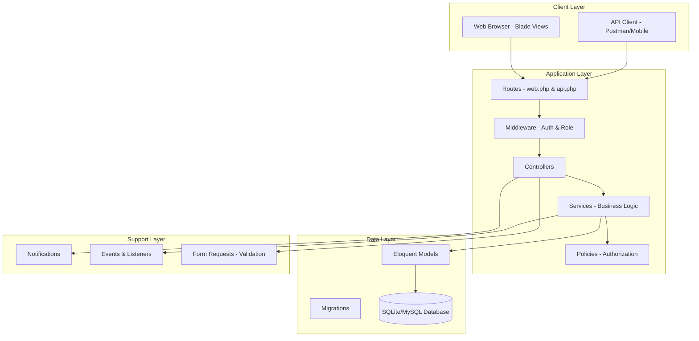
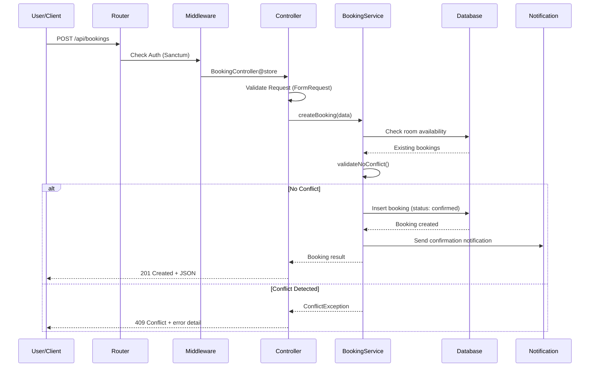
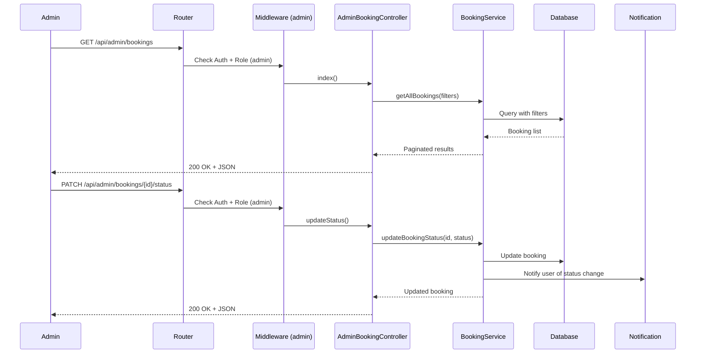
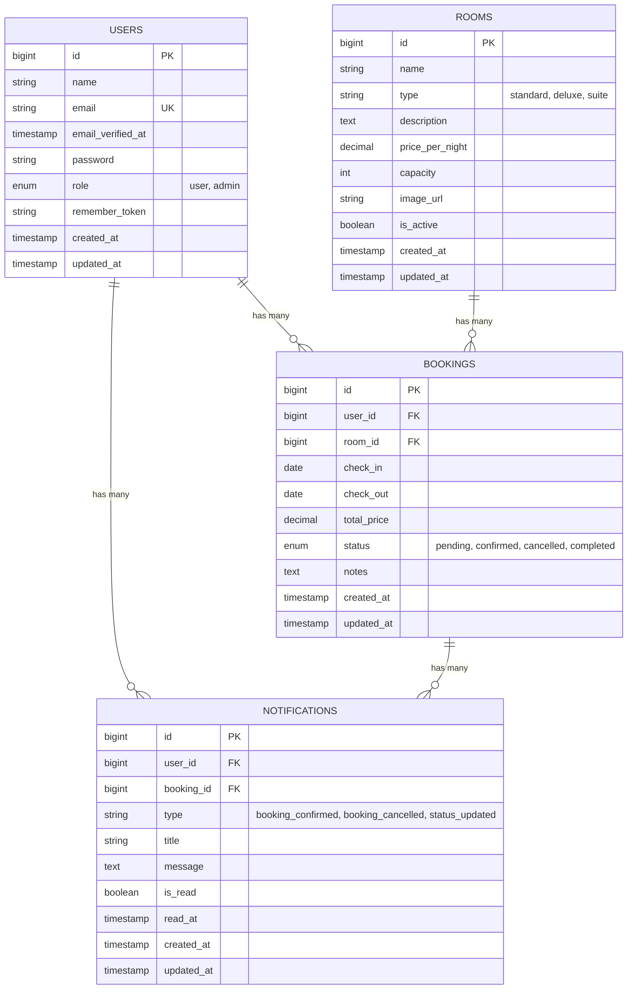

# Design Document: Bestay - Sistem Booking Hotel Online

## Overview

Bestay adalah sistem pemesanan kamar hotel/penginapan online yang dibangun menggunakan Laravel 12. Sistem ini memungkinkan pengguna (user) untuk mencari dan memesan kamar hotel berdasarkan tanggal yang tersedia, sementara admin dapat mengelola data kamar, melihat semua booking, dan menangani konflik jadwal.

Fitur utama meliputi: manajemen jadwal booking dengan validasi bentrok (conflict/clash detection), role-based access control (user & admin), RESTful API dengan Laravel Sanctum untuk keamanan token, serta sistem notifikasi sederhana untuk konfirmasi booking dan perubahan status.

Arsitektur mengikuti standar Laravel MVC dengan tambahan Service Layer untuk business logic, khususnya algoritma validasi bentrok jadwal. Sistem menggunakan SQLite untuk development dan mendukung MySQL/PostgreSQL untuk production.

## Architecture

### System Architecture Overview



### Request Flow (Sequence Diagram)



### Admin Booking Management Flow



## Components and Interfaces

### Component 1: AuthController

**Purpose**: Menangani registrasi, login, logout, dan manajemen token Sanctum.

**Interface**:
```php
class AuthController extends Controller
{
    public function register(RegisterRequest $request): JsonResponse;
    public function login(LoginRequest $request): JsonResponse;
    public function logout(Request $request): JsonResponse;
    public function profile(Request $request): JsonResponse;
}
```

**Responsibilities**:
- Registrasi user baru dengan role default 'user'
- Autentikasi dan penerbitan token Sanctum
- Logout dan revoke token
- Menampilkan profil user yang sedang login

### Component 2: RoomController

**Purpose**: CRUD operasi untuk data kamar hotel (admin only untuk CUD, semua user bisa Read).

**Interface**:
```php
class RoomController extends Controller
{
    public function index(Request $request): JsonResponse;       // List semua kamar
    public function show(Room $room): JsonResponse;              // Detail kamar
    public function store(StoreRoomRequest $request): JsonResponse;   // Admin: tambah kamar
    public function update(UpdateRoomRequest $request, Room $room): JsonResponse; // Admin: edit
    public function destroy(Room $room): JsonResponse;           // Admin: hapus
    public function availability(Room $room, Request $request): JsonResponse; // Cek ketersediaan
}
```

**Responsibilities**:
- Menampilkan daftar kamar dengan filter (tipe, harga, kapasitas)
- CRUD kamar (admin only via Policy)
- Cek ketersediaan kamar berdasarkan rentang tanggal

### Component 3: BookingController

**Purpose**: Menangani pembuatan, pembatalan, dan pengelolaan booking oleh user.

**Interface**:
```php
class BookingController extends Controller
{
    public function index(Request $request): JsonResponse;       // List booking user
    public function store(StoreBookingRequest $request): JsonResponse; // Buat booking baru
    public function show(Booking $booking): JsonResponse;        // Detail booking
    public function cancel(Booking $booking): JsonResponse;      // Batalkan booking
}
```

**Responsibilities**:
- Menampilkan daftar booking milik user yang login
- Membuat booking baru dengan validasi bentrok
- Menampilkan detail booking
- Membatalkan booking (hanya milik sendiri, via Policy)

### Component 4: AdminBookingController

**Purpose**: Pengelolaan semua booking oleh admin.

**Interface**:
```php
class AdminBookingController extends Controller
{
    public function index(Request $request): JsonResponse;       // Semua booking
    public function show(Booking $booking): JsonResponse;        // Detail booking
    public function updateStatus(UpdateStatusRequest $request, Booking $booking): JsonResponse;
    public function conflicts(Request $request): JsonResponse;   // List konflik
}
```

**Responsibilities**:
- Melihat semua booking dari semua user
- Mengubah status booking (confirmed, cancelled, completed)
- Melihat daftar booking yang berkonflik

### Component 5: BookingService

**Purpose**: Business logic layer untuk operasi booking, termasuk validasi bentrok.

**Interface**:
```php
class BookingService
{
    public function createBooking(array $data, User $user): Booking;
    public function cancelBooking(Booking $booking): Booking;
    public function updateStatus(Booking $booking, string $status): Booking;
    public function checkAvailability(int $roomId, string $checkIn, string $checkOut): bool;
    public function getConflictingBookings(int $roomId, string $checkIn, string $checkOut): Collection;
    public function getAllBookings(array $filters = []): LengthAwarePaginator;
}
```

**Responsibilities**:
- Validasi bentrok jadwal sebelum membuat booking
- Membuat booking baru dengan status 'confirmed'
- Mengelola perubahan status booking
- Mengecek ketersediaan kamar untuk rentang tanggal tertentu

### Component 6: NotificationService

**Purpose**: Mengirim notifikasi ke user terkait status booking.

**Interface**:
```php
class NotificationService
{
    public function sendBookingConfirmation(Booking $booking): void;
    public function sendBookingCancellation(Booking $booking): void;
    public function sendStatusUpdate(Booking $booking, string $oldStatus): void;
}
```

**Responsibilities**:
- Notifikasi konfirmasi booking berhasil
- Notifikasi pembatalan booking
- Notifikasi perubahan status oleh admin


## Data Models

### Entity Relationship Diagram (ERD)



### Model 1: User

```php
class User extends Authenticatable
{
    use HasFactory, Notifiable, HasApiTokens;

    protected $fillable = ['name', 'email', 'password', 'role'];

    protected $hidden = ['password', 'remember_token'];

    protected function casts(): array
    {
        return [
            'email_verified_at' => 'datetime',
            'password' => 'hashed',
        ];
    }

    // Relations
    public function bookings(): HasMany;
    public function notifications(): HasMany;

    // Helpers
    public function isAdmin(): bool;
}
```

**Validation Rules**:
- `name`: required, string, max:255
- `email`: required, email, unique:users
- `password`: required, min:8, confirmed
- `role`: enum ['user', 'admin'], default 'user'

### Model 2: Room

```php
class Room extends Model
{
    use HasFactory;

    protected $fillable = [
        'name', 'type', 'description',
        'price_per_night', 'capacity', 'image_url', 'is_active'
    ];

    protected function casts(): array
    {
        return [
            'price_per_night' => 'decimal:2',
            'is_active' => 'boolean',
        ];
    }

    // Relations
    public function bookings(): HasMany;

    // Scopes
    public function scopeActive(Builder $query): Builder;
    public function scopeAvailableBetween(Builder $query, string $checkIn, string $checkOut): Builder;
}
```

**Validation Rules**:
- `name`: required, string, max:255
- `type`: required, in:standard,deluxe,suite
- `description`: nullable, string
- `price_per_night`: required, numeric, min:0
- `capacity`: required, integer, min:1
- `is_active`: boolean, default true

### Model 3: Booking

```php
class Booking extends Model
{
    use HasFactory;

    protected $fillable = [
        'user_id', 'room_id', 'check_in', 'check_out',
        'total_price', 'status', 'notes'
    ];

    protected function casts(): array
    {
        return [
            'check_in' => 'date',
            'check_out' => 'date',
            'total_price' => 'decimal:2',
        ];
    }

    // Relations
    public function user(): BelongsTo;
    public function room(): BelongsTo;
    public function notifications(): HasMany;

    // Accessors
    public function getDurationAttribute(): int; // jumlah malam
    public function getIsActiveAttribute(): bool;
}
```

**Validation Rules**:
- `room_id`: required, exists:rooms,id
- `check_in`: required, date, after_or_equal:today
- `check_out`: required, date, after:check_in
- `notes`: nullable, string, max:500

### Model 4: Notification

```php
class Notification extends Model
{
    use HasFactory;

    protected $fillable = [
        'user_id', 'booking_id', 'type',
        'title', 'message', 'is_read', 'read_at'
    ];

    protected function casts(): array
    {
        return [
            'is_read' => 'boolean',
            'read_at' => 'datetime',
        ];
    }

    // Relations
    public function user(): BelongsTo;
    public function booking(): BelongsTo;

    // Scopes
    public function scopeUnread(Builder $query): Builder;
}
```

## Algorithmic Pseudocode

### Algoritma Utama: Validasi Bentrok Jadwal (Conflict Detection)

```php
/**
 * ALGORITHM: checkBookingConflict
 * 
 * Mendeteksi apakah booking baru bentrok dengan booking yang sudah ada
 * pada kamar yang sama. Dua booking dianggap bentrok jika rentang tanggalnya
 * overlap (bersinggungan).
 * 
 * Logika overlap: Booking A bentrok dengan Booking B jika dan hanya jika:
 *   A.check_in < B.check_out AND A.check_out > B.check_in
 */
ALGORITHM checkBookingConflict(roomId, checkIn, checkOut)
INPUT: 
    roomId: integer - ID kamar yang akan dibooking
    checkIn: date - tanggal check-in yang diinginkan
    checkOut: date - tanggal check-out yang diinginkan
OUTPUT: 
    conflicts: Collection - daftar booking yang bentrok (kosong jika tidak ada)

PRECONDITIONS:
    - checkIn < checkOut (check-out harus setelah check-in)
    - checkIn >= today (tidak boleh booking di masa lalu)
    - roomId merujuk ke kamar yang valid dan aktif

POSTCONDITIONS:
    - Jika conflicts kosong → kamar tersedia untuk rentang tanggal tersebut
    - Jika conflicts tidak kosong → kamar TIDAK tersedia, ada bentrok
    - Tidak ada side effect pada data yang sudah ada

BEGIN
    // Query semua booking aktif pada kamar yang sama
    // yang overlap dengan rentang tanggal yang diminta
    conflicts ← Booking::where('room_id', roomId)
        ->whereIn('status', ['pending', 'confirmed'])
        ->where('check_in', '<', checkOut)
        ->where('check_out', '>', checkIn)
        ->get()
    
    RETURN conflicts
END
```

### Algoritma: Pembuatan Booking Baru

```php
/**
 * ALGORITHM: createBooking
 * 
 * Membuat booking baru setelah memvalidasi tidak ada konflik jadwal.
 * Menggunakan database transaction untuk menjamin konsistensi data.
 */
ALGORITHM createBooking(data, user)
INPUT:
    data: array {room_id, check_in, check_out, notes?}
    user: User - user yang membuat booking
OUTPUT:
    booking: Booking - booking yang berhasil dibuat
THROWS:
    BookingConflictException - jika ada bentrok jadwal
    RoomNotAvailableException - jika kamar tidak aktif

PRECONDITIONS:
    - user sudah terautentikasi
    - data sudah tervalidasi oleh FormRequest
    - data.check_in < data.check_out
    - data.check_in >= today

POSTCONDITIONS:
    - Booking baru tersimpan di database dengan status 'confirmed'
    - total_price dihitung otomatis: jumlah_malam × price_per_night
    - Notifikasi konfirmasi terkirim ke user
    - Tidak ada booking lain yang bentrok pada kamar & tanggal yang sama

BEGIN
    // Step 1: Validasi kamar aktif
    room ← Room::findOrFail(data.room_id)
    IF NOT room.is_active THEN
        THROW RoomNotAvailableException("Kamar tidak tersedia")
    END IF

    // Step 2: Cek konflik jadwal (dalam transaction)
    DB::beginTransaction()
    TRY
        // Lock untuk mencegah race condition
        conflicts ← checkBookingConflict(data.room_id, data.check_in, data.check_out)
        
        IF conflicts.isNotEmpty() THEN
            DB::rollBack()
            THROW BookingConflictException(conflicts)
        END IF

        // Step 3: Hitung total harga
        duration ← diffInDays(data.check_in, data.check_out)
        totalPrice ← duration × room.price_per_night

        // Step 4: Simpan booking
        booking ← Booking::create({
            user_id: user.id,
            room_id: data.room_id,
            check_in: data.check_in,
            check_out: data.check_out,
            total_price: totalPrice,
            status: 'confirmed',
            notes: data.notes ?? null
        })

        DB::commit()

        // Step 5: Kirim notifikasi (async)
        sendBookingConfirmation(booking)

        RETURN booking
    CATCH Exception
        DB::rollBack()
        THROW
    END TRY
END
```

### Algoritma: Cek Ketersediaan Kamar

```php
/**
 * ALGORITHM: checkRoomAvailability
 * 
 * Mengecek apakah kamar tersedia untuk rentang tanggal tertentu.
 * Mengembalikan boolean sederhana untuk quick-check.
 */
ALGORITHM checkRoomAvailability(roomId, checkIn, checkOut)
INPUT:
    roomId: integer
    checkIn: date
    checkOut: date
OUTPUT:
    available: boolean

PRECONDITIONS:
    - checkIn < checkOut
    - Room dengan roomId ada di database

POSTCONDITIONS:
    - true jika tidak ada booking aktif yang overlap
    - false jika ada minimal 1 booking aktif yang overlap

BEGIN
    conflicts ← checkBookingConflict(roomId, checkIn, checkOut)
    RETURN conflicts.isEmpty()
END
```

## Key Functions with Formal Specifications

### Function 1: BookingService::createBooking()

```php
public function createBooking(array $data, User $user): Booking
```

**Preconditions:**
- `$user` adalah instance User yang valid dan terautentikasi
- `$data['room_id']` merujuk ke Room yang ada di database
- `$data['check_in']` adalah tanggal valid, >= hari ini
- `$data['check_out']` adalah tanggal valid, > `$data['check_in']`
- `$data['notes']` opsional, string max 500 karakter

**Postconditions:**
- Return Booking object dengan status 'confirmed'
- `booking.total_price` = jumlah_malam × room.price_per_night
- Tidak ada booking lain pada room yang sama dengan tanggal overlap
- Notifikasi konfirmasi terkirim ke user
- Jika gagal: throw exception, tidak ada data yang berubah (transactional)

**Loop Invariants:** N/A (no loops)

### Function 2: BookingService::checkAvailability()

```php
public function checkAvailability(int $roomId, string $checkIn, string $checkOut): bool
```

**Preconditions:**
- `$roomId` merujuk ke Room yang valid
- `$checkIn` format date valid (Y-m-d)
- `$checkOut` format date valid (Y-m-d), setelah `$checkIn`

**Postconditions:**
- Return `true` jika tidak ada booking aktif (pending/confirmed) yang overlap
- Return `false` jika ada minimal 1 booking aktif yang overlap
- Tidak ada side effect (read-only operation)

**Loop Invariants:** N/A

### Function 3: BookingService::getConflictingBookings()

```php
public function getConflictingBookings(int $roomId, string $checkIn, string $checkOut): Collection
```

**Preconditions:**
- `$roomId` valid
- `$checkIn` < `$checkOut`
- Kedua tanggal dalam format Y-m-d

**Postconditions:**
- Return Collection berisi semua Booking yang overlap
- Setiap booking dalam collection memenuhi: `booking.check_in < $checkOut AND booking.check_out > $checkIn`
- Hanya booking dengan status 'pending' atau 'confirmed' yang termasuk
- Collection kosong jika tidak ada konflik

**Loop Invariants:** N/A

### Function 4: User::isAdmin()

```php
public function isAdmin(): bool
```

**Preconditions:**
- Instance User valid dengan property `role` terisi

**Postconditions:**
- Return `true` jika dan hanya jika `$this->role === 'admin'`
- Tidak ada side effect

**Loop Invariants:** N/A

### Function 5: BookingPolicy::cancel()

```php
public function cancel(User $user, Booking $booking): bool
```

**Preconditions:**
- `$user` terautentikasi
- `$booking` ada di database

**Postconditions:**
- Return `true` jika: user adalah admin ATAU (user adalah pemilik booking DAN status booking bukan 'cancelled'/'completed')
- Return `false` untuk semua kondisi lainnya

**Loop Invariants:** N/A


## Example Usage

### Contoh 1: Registrasi dan Login

```php
// Registrasi user baru
$response = Http::post('/api/register', [
    'name' => 'John Doe',
    'email' => 'john@example.com',
    'password' => 'password123',
    'password_confirmation' => 'password123',
]);
// Response: 201 Created
// { "user": {...}, "token": "1|abc123..." }

// Login
$response = Http::post('/api/login', [
    'email' => 'john@example.com',
    'password' => 'password123',
]);
// Response: 200 OK
// { "user": {...}, "token": "2|def456..." }
```

### Contoh 2: Membuat Booking (Sukses)

```php
// User membuat booking kamar
$response = Http::withToken($token)->post('/api/bookings', [
    'room_id' => 1,
    'check_in' => '2025-02-01',
    'check_out' => '2025-02-03',
    'notes' => 'Minta kamar lantai atas',
]);
// Response: 201 Created
// {
//   "booking": {
//     "id": 1,
//     "room_id": 1,
//     "user_id": 1,
//     "check_in": "2025-02-01",
//     "check_out": "2025-02-03",
//     "total_price": 500000.00,
//     "status": "confirmed",
//     "notes": "Minta kamar lantai atas"
//   }
// }
```

### Contoh 3: Booking Bentrok (Conflict)

```php
// User lain mencoba booking kamar yang sama di tanggal overlap
$response = Http::withToken($token2)->post('/api/bookings', [
    'room_id' => 1,
    'check_in' => '2025-02-02',
    'check_out' => '2025-02-05',
]);
// Response: 409 Conflict
// {
//   "message": "Kamar tidak tersedia untuk tanggal yang dipilih",
//   "conflicts": [
//     {
//       "id": 1,
//       "check_in": "2025-02-01",
//       "check_out": "2025-02-03",
//       "status": "confirmed"
//     }
//   ]
// }
```

### Contoh 4: Admin Mengubah Status Booking

```php
// Admin mengubah status booking
$response = Http::withToken($adminToken)->patch('/api/admin/bookings/1/status', [
    'status' => 'completed',
]);
// Response: 200 OK
// { "booking": { "id": 1, "status": "completed", ... } }
```

### Contoh 5: Cek Ketersediaan Kamar

```php
// Cek apakah kamar tersedia
$response = Http::withToken($token)->get('/api/rooms/1/availability', [
    'check_in' => '2025-03-01',
    'check_out' => '2025-03-05',
]);
// Response: 200 OK
// { "available": true, "room": {...} }
```

### Contoh 6: Melihat Notifikasi

```php
// User melihat notifikasi
$response = Http::withToken($token)->get('/api/notifications');
// Response: 200 OK
// {
//   "notifications": [
//     {
//       "id": 1,
//       "type": "booking_confirmed",
//       "title": "Booking Dikonfirmasi",
//       "message": "Booking Anda untuk Kamar Deluxe 101 (1-3 Feb 2025) telah dikonfirmasi.",
//       "is_read": false,
//       "created_at": "2025-01-28T10:00:00Z"
//     }
//   ]
// }
```

## Correctness Properties

*A property is a characteristic or behavior that should hold true across all valid executions of a system — essentially, a formal statement about what the system should do. Properties serve as the bridge between human-readable specifications and machine-verifiable correctness guarantees.*

### Property 1: No Double Booking

*For any* room and any set of active bookings (status: pending or confirmed) on that room, no two bookings shall have overlapping date ranges. Two bookings overlap if and only if booking A's check_in is before booking B's check_out AND booking A's check_out is after booking B's check_in.

**Validates: Requirements 5.3, 5.4, 9.6**

### Property 2: Total Price Consistency

*For any* booking in the system, the total_price shall equal the number of nights (difference in days between check_in and check_out) multiplied by the room's price_per_night.

**Validates: Requirements 5.2, 9.5**

### Property 3: Date Range Validity

*For any* booking in the system, the check_in date shall be strictly before the check_out date.

**Validates: Requirements 5.7, 9.1**

### Property 4: Conflict Detection Correctness

*For any* room and date range, the availability check shall return true if and only if there are no active bookings (pending/confirmed) on that room whose date range overlaps with the requested range.

**Validates: Requirements 4.1, 4.2, 4.3**

### Property 5: User Authorization Isolation

*For any* authenticated user with role 'user', the booking list endpoint shall return only bookings where user_id matches the authenticated user's ID. Attempting to access another user's booking shall result in a 403 response.

**Validates: Requirements 6.1, 6.3, 10.2**

### Property 6: Role-Based Access Control

*For any* non-admin user attempting to access admin-only endpoints (room CUD operations, admin booking management), the system shall return a 403 Forbidden response.

**Validates: Requirements 3.6, 7.7**

### Property 7: Status Transition Validity

*For any* booking status update, the system shall only allow valid transitions: pending → confirmed or cancelled, confirmed → cancelled or completed. Bookings with status 'cancelled' or 'completed' shall reject all status change attempts.

**Validates: Requirements 6.5, 7.3, 7.4, 7.5**

### Property 8: Authentication Enforcement

*For any* protected API endpoint and any request without a valid Sanctum token, the system shall return a 401 Unauthorized response.

**Validates: Requirements 2.5, 10.1**

### Property 9: Registration Validation

*For any* registration request with invalid data (duplicate email, password shorter than 8 characters, or mismatched password confirmation), the system shall reject the request with a 422 validation error and not create a user account.

**Validates: Requirements 1.2, 1.3, 1.4**

### Property 10: Notification on Booking Events

*For any* booking state change (creation, cancellation, or admin status update), the system shall create a notification record for the booking owner with the appropriate type and message.

**Validates: Requirements 8.1, 8.2, 8.3**

### Property 11: Token Lifecycle

*For any* authenticated user, after performing a logout operation, the previously issued token shall no longer grant access to protected endpoints.

**Validates: Requirement 2.3**

### Property 12: Room Filter Correctness

*For any* room list request with filter criteria (type, price range, capacity), all returned rooms shall match every specified filter criterion, and no room matching all criteria shall be excluded from the results.

**Validates: Requirement 3.7**

## Error Handling

### Error Scenario 1: Booking Conflict (409)

**Condition**: User mencoba membuat booking pada kamar yang sudah dibooking di tanggal yang overlap.
**Response**: HTTP 409 Conflict dengan detail booking yang bentrok.
**Recovery**: User diminta memilih tanggal lain atau kamar lain.

```php
// Response format
{
    "message": "Kamar tidak tersedia untuk tanggal yang dipilih",
    "error_code": "BOOKING_CONFLICT",
    "conflicts": [
        {
            "booking_id": 5,
            "check_in": "2025-02-01",
            "check_out": "2025-02-03"
        }
    ]
}
```

### Error Scenario 2: Room Not Available (422)

**Condition**: Kamar yang dipilih tidak aktif (is_active = false).
**Response**: HTTP 422 Unprocessable Entity.
**Recovery**: User memilih kamar lain yang aktif.

### Error Scenario 3: Unauthorized Access (403)

**Condition**: User mencoba mengakses resource yang bukan miliknya atau endpoint admin.
**Response**: HTTP 403 Forbidden.
**Recovery**: Redirect ke halaman yang sesuai dengan role.

### Error Scenario 4: Invalid Date Range (422)

**Condition**: check_in >= check_out, atau check_in < today.
**Response**: HTTP 422 dengan validation errors.
**Recovery**: User memperbaiki input tanggal.

### Error Scenario 5: Unauthenticated (401)

**Condition**: Request tanpa token atau token expired.
**Response**: HTTP 401 Unauthorized.
**Recovery**: User login ulang untuk mendapatkan token baru.

## Testing Strategy

### Unit Testing Approach

Fokus pada business logic di Service layer:

```php
// tests/Unit/BookingServiceTest.php
class BookingServiceTest extends TestCase
{
    /** @test */
    public function it_detects_overlapping_bookings(): void
    {
        // Arrange: buat booking existing 1-3 Feb
        // Act: cek conflict untuk 2-5 Feb
        // Assert: conflict terdeteksi
    }

    /** @test */
    public function it_allows_non_overlapping_bookings(): void
    {
        // Arrange: buat booking existing 1-3 Feb
        // Act: cek conflict untuk 4-6 Feb
        // Assert: tidak ada conflict
    }

    /** @test */
    public function it_calculates_total_price_correctly(): void
    {
        // Arrange: kamar harga 250000/malam
        // Act: booking 3 malam
        // Assert: total = 750000
    }
}
```

### Feature Testing Approach

Fokus pada API endpoint end-to-end:

```php
// tests/Feature/BookingApiTest.php
class BookingApiTest extends TestCase
{
    /** @test */
    public function user_can_create_booking_for_available_room(): void
    {
        // Full flow: auth → create booking → verify response & DB
    }

    /** @test */
    public function user_cannot_create_conflicting_booking(): void
    {
        // Full flow: create booking → try overlapping → expect 409
    }

    /** @test */
    public function admin_can_view_all_bookings(): void
    {
        // Verify admin access to all bookings
    }

    /** @test */
    public function user_cannot_access_admin_endpoints(): void
    {
        // Verify role-based access control
    }
}
```

### Property-Based Testing Approach

**Property Test Library**: PHPUnit dengan data providers untuk simulasi property-based testing.

```php
/**
 * @dataProvider randomDateRangeProvider
 */
public function test_no_double_booking_property(string $checkIn1, string $checkOut1, string $checkIn2, string $checkOut2): void
{
    // Jika booking pertama berhasil dan tanggal kedua overlap,
    // maka booking kedua HARUS gagal
}
```

## Performance Considerations

- **Database Indexing**: Composite index pada `bookings(room_id, check_in, check_out, status)` untuk query conflict detection yang cepat
- **Eager Loading**: Gunakan `with()` untuk menghindari N+1 query pada relasi booking-room dan booking-user
- **Pagination**: Semua list endpoint menggunakan pagination (default 15 per page)
- **Query Optimization**: Conflict check menggunakan single query dengan WHERE clause, bukan loop di PHP
- **Caching**: Room list yang jarang berubah bisa di-cache (opsional untuk scope project ini)

## Security Considerations

- **Authentication**: Laravel Sanctum token-based auth untuk API
- **Authorization**: Gate/Policy untuk memastikan user hanya akses data miliknya
- **Input Validation**: FormRequest classes untuk validasi semua input
- **SQL Injection Prevention**: Eloquent ORM dengan parameterized queries
- **Mass Assignment Protection**: `$fillable` pada semua model
- **Rate Limiting**: Laravel built-in rate limiter pada auth endpoints
- **CORS**: Konfigurasi CORS untuk API access dari frontend
- **Token Expiration**: Token Sanctum dengan expiration time

## Dependencies

### Backend (composer.json)

| Package | Purpose |
|---------|---------|
| laravel/framework ^12.0 | Core framework |
| laravel/sanctum | API token authentication |
| laravel/breeze | Auth scaffolding (Blade views) |

### Dev Dependencies

| Package | Purpose |
|---------|---------|
| phpunit/phpunit ^11.5 | Unit & feature testing |
| fakerphp/faker ^1.23 | Test data generation |
| laravel/pint ^1.24 | Code style |

### API Documentation

| Tool | Purpose |
|------|---------|
| Postman | API documentation & testing collection |

## API Endpoints Summary

### Auth Routes (Public)

| Method | Endpoint | Description |
|--------|----------|-------------|
| POST | /api/register | Registrasi user baru |
| POST | /api/login | Login & dapatkan token |

### Auth Routes (Protected - Sanctum)

| Method | Endpoint | Description |
|--------|----------|-------------|
| POST | /api/logout | Logout & revoke token |
| GET | /api/profile | Profil user yang login |

### Room Routes (Mixed)

| Method | Endpoint | Description | Access |
|--------|----------|-------------|--------|
| GET | /api/rooms | List semua kamar aktif | Public |
| GET | /api/rooms/{id} | Detail kamar | Public |
| GET | /api/rooms/{id}/availability | Cek ketersediaan | Auth |
| POST | /api/rooms | Tambah kamar | Admin |
| PUT | /api/rooms/{id} | Edit kamar | Admin |
| DELETE | /api/rooms/{id} | Hapus kamar | Admin |

### Booking Routes (Auth Required)

| Method | Endpoint | Description | Access |
|--------|----------|-------------|--------|
| GET | /api/bookings | List booking user | User |
| POST | /api/bookings | Buat booking baru | User |
| GET | /api/bookings/{id} | Detail booking | Owner |
| PATCH | /api/bookings/{id}/cancel | Batalkan booking | Owner |

### Admin Routes (Admin Only)

| Method | Endpoint | Description |
|--------|----------|-------------|
| GET | /api/admin/bookings | Semua booking |
| GET | /api/admin/bookings/{id} | Detail booking |
| PATCH | /api/admin/bookings/{id}/status | Ubah status |
| GET | /api/admin/bookings/conflicts | List konflik |

### Notification Routes (Auth Required)

| Method | Endpoint | Description |
|--------|----------|-------------|
| GET | /api/notifications | List notifikasi user |
| PATCH | /api/notifications/{id}/read | Tandai sudah dibaca |
| PATCH | /api/notifications/read-all | Tandai semua dibaca |
