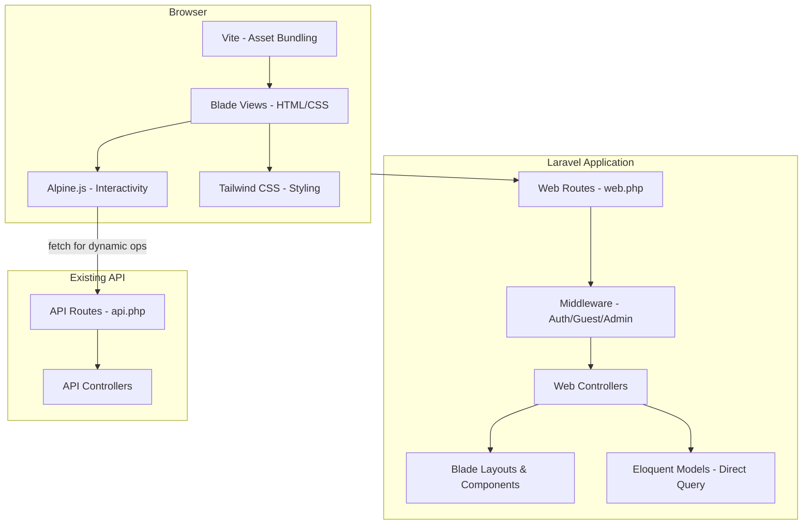

# Design Document: Bestay Frontend

## Overview

Bestay Frontend is the user-facing web interface for the Bestay hotel booking system, built as Blade templates within the existing Laravel 12 project. The frontend consumes the already-complete REST API internally (same-origin, no CORS) and provides a polished, Airbnb-inspired booking experience using Tailwind CSS for styling and Alpine.js for client-side interactivity.

The design system follows the DESIGN.md specification closely — a white canvas (#ffffff) with ink text (#222222), a single brand accent of Rausch (#ff385c) for primary CTAs, Inter as the font substitute for Airbnb Cereal VF, soft rounded corners everywhere (8px buttons, 14px cards, pill search bar), photography-led layouts, and generous whitespace. The frontend is mobile-first with responsive breakpoints at 744px, 1128px, and 1440px.

The architecture uses Laravel web routes that render Blade views. Authentication state is managed via Laravel sessions (web guard) rather than API tokens — the web controllers query Eloquent models directly for server-rendered pages, while Alpine.js handles dynamic interactions (modals, date pickers, form validation, availability checks) via fetch() calls to the existing API endpoints.

## Architecture

### Frontend Architecture Overview

## Correctness Properties

*A property is a characteristic or behavior that should hold true across all valid executions of a system — essentially, a formal statement about what the system should do. Properties serve as the bridge between human-readable specifications and machine-verifiable correctness guarantees.*

### Property 1: Room filter correctness

*For any* set of active rooms and any combination of filters (type, min_price, max_price, capacity), all rooms displayed in the listing SHALL satisfy every applied filter simultaneously — each displayed room's type matches the type filter (if set), its price_per_night is within [min_price, max_price] (if set), and its capacity is >= the capacity filter (if set).

**Validates: Requirements 3.2, 3.3, 3.4**

### Property 2: Pagination bounds

*For any* paginated result set (rooms or bookings), each page SHALL contain at most 15 items, and the total item count across all pages SHALL equal the total number of matching records.

**Validates: Requirements 3.5, 6.6**

### Property 3: Total price calculation

*For any* room with a given price_per_night and any valid date range (check_in, check_out where check_out > check_in), the displayed total price SHALL equal (number of nights between check_in and check_out) × price_per_night.

**Validates: Requirements 4.4**

### Property 4: Booking sort order

*For any* set of bookings belonging to a user, the dashboard SHALL display them in descending order of creation date — for every adjacent pair (booking_i, booking_i+1) in the displayed list, booking_i.created_at >= booking_i+1.created_at.

**Validates: Requirements 6.1**

### Property 5: Status badge uniqueness

*For any* booking status value (pending, confirmed, cancelled, completed), the rendered badge SHALL map to a distinct visual class, and no two different statuses SHALL produce the same badge styling.

**Validates: Requirements 6.3**

### Property 6: Admin booking status filter

*For any* set of bookings and any status filter value, all bookings displayed in the admin table SHALL have a status matching the selected filter.

**Validates: Requirements 8.2**

### Property 7: Date validation prevents invalid ranges

*For any* pair of dates where check_out is not strictly after check_in, the date selection component SHALL prevent the availability API call from being made and SHALL display a validation message.

**Validates: Requirements 10.1**

### Property 8: Validation error display completeness

*For any* set of field-level validation errors returned by the server, the frontend SHALL display each error message adjacent to its corresponding form field, and no error SHALL be silently dropped.

**Validates: Requirements 10.2**
