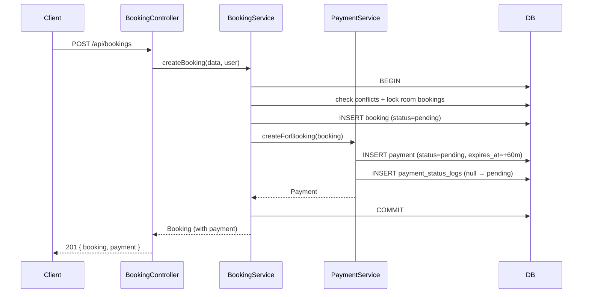
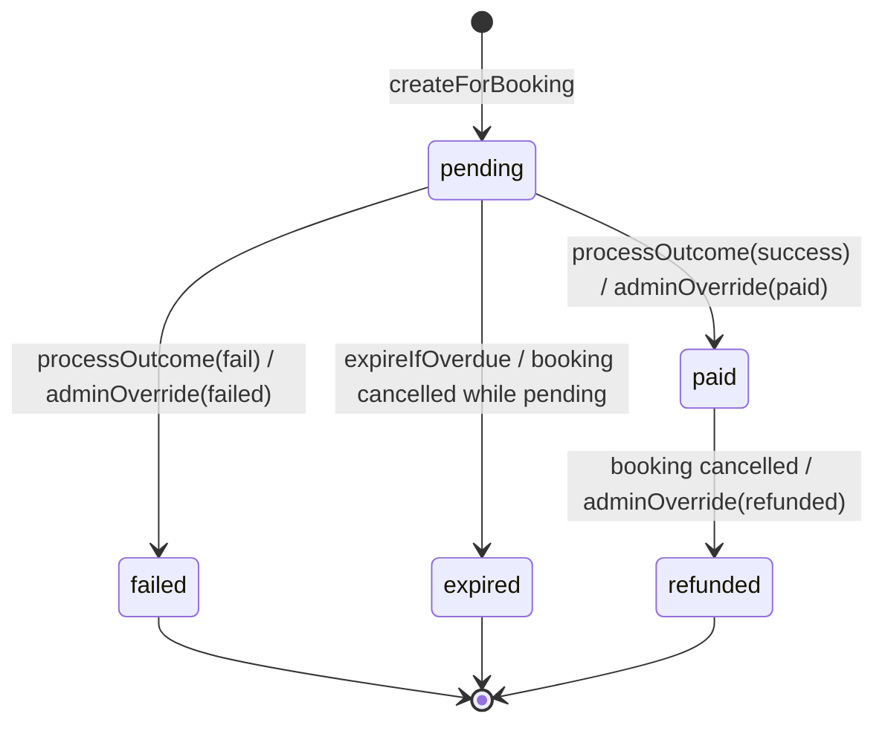
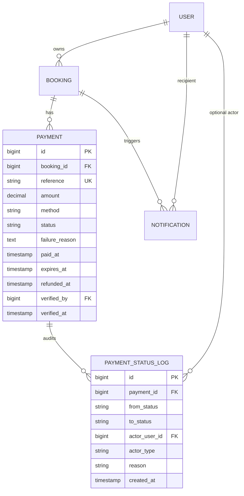

# Design Document: Dummy Payment

## Overview

The Dummy Payment feature introduces a simulated payment workflow into the existing Bestay Laravel application. Every `Booking` becomes the parent of a `Payment` aggregate that progresses through a small, explicit state machine (`pending → paid|failed|expired → refunded`). A new `PaymentService` owns lifecycle logic (creation, method selection, outcome submission, expiry, refund, admin override), while the existing `BookingService` is adapted so that a booking is only `confirmed` after its payment is `paid`.

The feature is deliberately scoped to:

- A new `payments` table plus a `payment_status_logs` audit table
- A new `App\Services\PaymentService`
- New API controllers (`PaymentController`, `AdminPaymentController`) and Web controllers (`Web\PaymentController`) that mirror the patterns used by `BookingController`
- A new `PaymentPolicy` analogous to `BookingPolicy`
- A scheduled console command `payments:expire` to sweep stale `pending` payments
- Extensions to `NotificationService` for payment-lifecycle notifications
- A surgical change to `BookingService::createBooking` so that a booking is created as `pending` inside the same transaction that creates the initial `Payment`
- A hook in `BookingService::cancelBooking` (and the admin booking status update) that delegates to `PaymentService` to transition an associated payment

This is an academic simulation: no real gateway is contacted, no tokenisation is performed, and the dummy `credit_card` method must never ask for, store, or log PAN/CVV data.

### Design Goals

1. **Preserve existing contracts.** Existing controllers, policies, and service signatures keep their current behaviour except where a requirement forces a change (specifically, `BookingService::createBooking` now defaults status to `pending`).
2. **Explicit, pure state machine.** Transition legality is encoded once, as a pure function on `Payment`, so it can be exercised with property-based tests independently of the database.
3. **Atomic transitions.** Every payment-status change that also mutates the booking happens inside a single `DB::transaction` with a row-level lock on the payment.
4. **Idempotent integration points.** Cancellation and refund triggers are safe to replay (Requirement 6.5) — a terminal payment is left unchanged on a repeat event.
5. **Auditability.** Every committed transition writes a row to `payment_status_logs` capturing source, target, actor, and timestamp (Requirements 7.6 and 8.6).

### Research Notes

- **Partial unique indexes.** SQLite (used in development) and PostgreSQL both support partial unique indexes (`CREATE UNIQUE INDEX ... WHERE status IN ('pending','paid')`). MySQL ≤ 8.0 does not. Because the project targets SQLite in dev and MySQL-compatible engines in production, the one-active-payment-per-booking invariant (Requirement 9.1, 9.4) is enforced at two layers: (a) an application-level `SELECT ... FOR UPDATE` guard inside a transaction in `PaymentService::createForBooking`, and (b) a partial unique index on drivers that support it (SQLite, PostgreSQL), raising an exception that `PaymentService` translates to a 409 conflict response. This mirrors how Laravel applications commonly layer defence-in-depth around unique-ish invariants.
- **Laravel 12 scheduling.** Laravel 12 schedules commands in `routes/console.php` via `Schedule::command(...)` (the new API) rather than the legacy `Kernel::schedule` method. The codebase already uses the new `bootstrap/app.php` layout so the expiry job will be registered through `Schedule::command('payments:expire')->everyFiveMinutes()` in `routes/console.php`. See the official scheduling docs: [Laravel Task Scheduling](https://laravel.com/docs/12.x/scheduling).
- **Property-based testing in PHP.** The project already uses PHPUnit 11. For property-based testing, the design recommends [giorgiosironi/eris](https://github.com/giorgiosironi/eris), which integrates as a trait on PHPUnit test cases and supports generators for strings, ints, sequences, and shrinking. This avoids implementing a PBT framework from scratch.

---

## Architecture

### High-level Layering

```
┌────────────────────────────┐
│  Routes (api.php / web.php)│
└────────────┬───────────────┘
             │
┌────────────▼─────────────────────────────────────────┐
│  Controllers                                         │
│  - Api\PaymentController                             │
│  - Api\AdminPaymentController                        │
│  - Web\PaymentController                             │
└────────────┬─────────────────────────────────────────┘
             │
┌────────────▼───────────────┐      ┌──────────────────────┐
│  PaymentService            │─────▶│ NotificationService  │
│  - createForBooking        │      │ (extended)           │
│  - selectMethod            │      └──────────────────────┘
│  - processOutcome          │
│  - expireIfOverdue         │      ┌──────────────────────┐
│  - refundOnCancellation    │─────▶│ BookingService       │
│  - adminOverride           │      │ (confirm / cancel)   │
│  - canTransition (pure)    │      └──────────────────────┘
└────────────┬───────────────┘
             │
┌────────────▼───────────────┐
│  Eloquent Models           │
│  - Payment                 │
│  - PaymentStatusLog        │
│  - Booking (adjusted)      │
└────────────────────────────┘
```

### Request Flow: Create Booking With Payment



### Payment Status State Machine



The state graph is intentionally a superset of the allowed `(source, target)` pairs in Requirement 8.1:

```
(pending, paid)
(pending, failed)
(pending, expired)
(paid, refunded)
```

Any other pair is rejected by `PaymentService::assertTransition($from, $to)` which is a pure function on an in-memory whitelist — making it trivial to exercise with property-based tests (see Correctness Properties).

### Atomicity Boundaries

Every state change that has an external side effect is executed inside a single `DB::transaction`:

| Operation                                      | Locks                                               | Updates in the same TX                                                                  |
| ---------------------------------------------- | --------------------------------------------------- | --------------------------------------------------------------------------------------- |
| `createForBooking`                             | `SELECT ... FOR UPDATE` on existing payments for booking_id | Insert `payments` row, insert `payment_status_logs` row                           |
| `processOutcome(success)`                      | `SELECT ... FOR UPDATE` on the target payment       | `payments.status=paid, paid_at=now`, `bookings.status=confirmed`, audit log             |
| `processOutcome(fail)`                         | same                                                | `payments.status=failed, failure_reason=...`, audit log                                 |
| `expireIfOverdue` / scheduled `payments:expire`| same                                                | `payments.status=expired`, and only if booking was `pending` → `bookings.status=cancelled`, audit log |
| `refundOnCancellation(booking)`                | `SELECT ... FOR UPDATE` on the payment              | `payments.status=refunded, refunded_at=now` (only if `paid`) OR `expired` (if `pending`), audit log |
| `adminOverride`                                | same                                                | payment status update + (optionally) booking update + audit log                          |

A failure anywhere inside the closure rolls the whole unit back (Requirement 8.5, 1.7, 3.6). The atomic update is retried up to 2 times on transient failure before returning an error to the caller.

### Notifications

`NotificationService` gains payment-aware helpers. They are invoked **after** the transactional block commits so that a notification failure cannot mask or reverse a successful transition (Requirement 10.4). Retries are handled via a queued job (see Error Handling below).

### Scheduling

`routes/console.php` registers two things:

1. An Artisan command `payments:expire` (class `App\Console\Commands\ExpirePendingPayments`) that iterates every `pending` payment with `expires_at < now()` and calls `PaymentService::expireIfOverdue($payment, actor: 'system')`.
2. A schedule entry `Schedule::command('payments:expire')->everyFiveMinutes()->withoutOverlapping();` (Requirement 4.4).

Additionally, on any GET of a payment detail endpoint, the controller calls `PaymentService::expireIfOverdue($payment, actor: 'guest')` before rendering so a Guest who views an expired pending payment sees it as `expired` immediately (Requirement 4.1).

---

## Components and Interfaces

### `App\Models\Payment`

Eloquent model with fillable fields matching the migration (see Data Models). Provides:

```php
class Payment extends Model
{
    public const STATUS_PENDING   = 'pending';
    public const STATUS_PAID      = 'paid';
    public const STATUS_FAILED    = 'failed';
    public const STATUS_EXPIRED   = 'expired';
    public const STATUS_REFUNDED  = 'refunded';

    public const METHOD_BANK_TRANSFER = 'bank_transfer';
    public const METHOD_E_WALLET      = 'e_wallet';
    public const METHOD_CREDIT_CARD   = 'credit_card';

    public const METHODS  = [self::METHOD_BANK_TRANSFER, self::METHOD_E_WALLET, self::METHOD_CREDIT_CARD];
    public const STATUSES = [self::STATUS_PENDING, self::STATUS_PAID, self::STATUS_FAILED, self::STATUS_EXPIRED, self::STATUS_REFUNDED];
    public const TERMINAL_STATUSES = [self::STATUS_FAILED, self::STATUS_EXPIRED, self::STATUS_REFUNDED];

    public function booking(): BelongsTo;
    public function statusLogs(): HasMany; // payment_status_logs
    public function verifier(): BelongsTo; // User who last verified (admin override)

    public function isExpired(): bool;            // expires_at < now()
    public function isTerminal(): bool;           // status ∈ TERMINAL_STATUSES
    public function isActive(): bool;             // status ∈ {pending, paid}
}
```

### `App\Models\PaymentStatusLog`

Audit row for each transition. Fields: `id`, `payment_id`, `from_status` (nullable for creation), `to_status`, `actor_user_id` (nullable for system actor), `actor_type` (`guest`|`admin`|`system`), `reason` (nullable, e.g., failure reason or unmet precondition), `created_at`.

### `App\Services\PaymentService`

Primary entry point for all payment state changes. Kept deliberately small — the state-machine whitelist is a class constant, and all mutations flow through `transition()`.

```php
class PaymentService
{
    public const EXPIRY_MINUTES   = 60;
    public const MAX_ATTEMPTS     = 5;   // Requirement 3.4

    private const ALLOWED_TRANSITIONS = [
        [self::PENDING, self::PAID],
        [self::PENDING, self::FAILED],
        [self::PENDING, self::EXPIRED],
        [self::PAID,    self::REFUNDED],
    ];

    public function __construct(
        protected NotificationService $notificationService,
    ) {}

    public function createForBooking(Booking $booking): Payment;

    public function selectMethod(Payment $payment, string $method): Payment;

    /**
     * @param 'success'|'fail' $outcome
     */
    public function processOutcome(Payment $payment, string $outcome, ?string $failureReason = null): Payment;

    public function expireIfOverdue(Payment $payment, string $actorType = 'system', ?User $actor = null): Payment;

    public function refundOnBookingCancellation(Booking $booking, ?User $actor = null): ?Payment;

    public function adminOverride(Payment $payment, string $targetStatus, User $admin, ?string $reason = null): Payment;

    /** Pure helper — the single source of truth for Requirement 8.1. */
    public static function canTransition(string $from, string $to): bool;

    /** Pure helper — idempotent reference generator: PAY-YYYYMMDD-XXXXXX */
    public static function generateReference(Carbon $now = null): string;
}
```

Every mutating method wraps its work in:

```php
return DB::transaction(function () use (...) {
    $payment = Payment::where('id', $payment->id)->lockForUpdate()->firstOrFail();
    // business rule checks (expiry, terminal, unmet preconditions)
    // self::assertTransition($from, $to)
    $payment->update([...]);
    PaymentStatusLog::create([...]);
    // optionally $this->bookingService->updateStatus(...) or direct update (see below)
    return $payment->fresh();
});
```

**Interaction with `BookingService`.** `PaymentService` does **not** call `BookingService::updateStatus()`, because that method enforces the *booking* transition graph which does not include `confirmed → cancelled` on expiry vs `pending → cancelled` correctly for this feature (it actually does, but calling it introduces a cross-service dependency). Instead, `PaymentService` updates the booking's `status` column directly *within the same transaction* using `$payment->booking()->lockForUpdate()->first()->update(['status' => ...])` only for the two cases driven by the payment lifecycle:

- `paid` → booking becomes `confirmed` (if currently `pending`)
- `expired` → booking becomes `cancelled` (only if currently `pending`, per Requirement 4.2)

For the reverse direction (booking cancelled → refund payment), `BookingService::cancelBooking` and `AdminBookingController::updateStatus` call `PaymentService::refundOnBookingCancellation($booking)` **after** the booking has been updated inside the same outer transaction.

### `App\Http\Controllers\PaymentController` (API)

API routes for Guest usage. Mirrors `BookingController` structure.

```php
class PaymentController extends Controller
{
    public function __construct(protected PaymentService $paymentService) {}

    public function index(Request $request): JsonResponse;           // 5.1
    public function show(Payment $payment): JsonResponse;             // 5.2, 4.1 (lazy expire)
    public function selectMethod(SelectPaymentMethodRequest, Payment): JsonResponse; // 2.2, 2.3, 2.4
    public function process(ProcessPaymentRequest, Payment): JsonResponse;           // 3.*, 4.3
    public function retry(Payment $payment): JsonResponse;            // 3.4 (creates new Payment for same booking)
}
```

Authorisation is enforced via `Gate::authorize('view'|'process', $payment)` resolved by `PaymentPolicy`.

### `App\Http\Controllers\AdminPaymentController` (API)

```php
class AdminPaymentController extends Controller
{
    public function __construct(protected PaymentService $paymentService) {}

    public function index(AdminPaymentIndexRequest $request): JsonResponse;     // 5.7, 5.8
    public function show(Payment $payment): JsonResponse;                       // (admin bypass via policy)
    public function updateStatus(AdminUpdatePaymentStatusRequest, Payment): JsonResponse; // 7.*
}
```

Mounted under `Route::middleware('admin')->prefix('admin')` alongside the admin booking routes.

### `App\Http\Controllers\Web\PaymentController` (Blade)

Renders the three Blade screens required by the Guest flow:

- `GET  /bookings/{booking}/payment` — show current active payment (lazy-expires if overdue)
- `POST /payments/{payment}/method`  — select method (Requirement 2)
- `GET  /payments/{payment}/confirm` — render the "success / fail" confirmation form
- `POST /payments/{payment}/confirm` — submit `outcome` and optional `failure_reason` (Requirement 3)
- `POST /payments/{payment}/retry`  — create new attempt after `failed` (Requirement 3.4)

Returns Blade views with `redirect()->back()->with(...)` semantics exactly like `Web\BookingController`.

### `App\Console\Commands\ExpirePendingPayments`

```php
class ExpirePendingPayments extends Command
{
    protected $signature   = 'payments:expire';
    protected $description = 'Transition pending payments past their expiry window to expired.';

    public function handle(PaymentService $paymentService): int
    {
        Payment::query()
            ->where('status', Payment::STATUS_PENDING)
            ->where('expires_at', '<', now())
            ->chunkById(100, function ($payments) use ($paymentService) {
                foreach ($payments as $payment) {
                    $paymentService->expireIfOverdue($payment, actorType: 'system');
                }
            });

        return self::SUCCESS;
    }
}
```

### Request Classes

All extend `FormRequest` and follow the conventions of `StoreBookingRequest` / `UpdateStatusRequest`.

```php
// SelectPaymentMethodRequest
'method' => ['required', 'string', Rule::in(Payment::METHODS)],

// ProcessPaymentRequest
'outcome'        => ['required', 'string', Rule::in(['success', 'fail'])],
'failure_reason' => ['required_if:outcome,fail', 'nullable', 'string', 'min:1', 'max:500'],

// AdminUpdatePaymentStatusRequest
'status' => ['required', 'string', Rule::in([Payment::STATUS_PAID, Payment::STATUS_FAILED, Payment::STATUS_REFUNDED])],
'reason' => ['nullable', 'string', 'max:500'],

// AdminPaymentIndexRequest
'status'     => ['nullable', Rule::in(Payment::STATUSES)],
'method'     => ['nullable', Rule::in(Payment::METHODS)],
'booking_id' => ['nullable', 'integer', 'exists:bookings,id'],
'page'       => ['nullable', 'integer', 'min:1'],
```

### `App\Policies\PaymentPolicy`

```php
class PaymentPolicy
{
    public function viewAny(User $user): bool { return true; }

    public function view(User $user, Payment $payment): bool
    {
        return $user->isAdmin() || $user->id === $payment->booking->user_id;
    }

    public function process(User $user, Payment $payment): bool
    {
        return $user->id === $payment->booking->user_id
            && $payment->status === Payment::STATUS_PENDING;
    }

    public function selectMethod(User $user, Payment $payment): bool
    {
        return $user->id === $payment->booking->user_id
            && $payment->status === Payment::STATUS_PENDING;
    }

    public function adminOverride(User $user, Payment $payment): bool
    {
        return $user->isAdmin();
    }
}
```

Registered via Laravel's auto-discovery convention (`App\Policies\PaymentPolicy` attaches to `App\Models\Payment`).

### `NotificationService` Extensions

New methods follow the voice and fields of the existing ones:

```php
public function sendPaymentSucceeded(Payment $payment): void;  // Requirement 10.1
public function sendPaymentFailed(Payment $payment): void;     // Requirement 10.2 (failed)
public function sendPaymentExpired(Payment $payment): void;    // Requirement 10.2 (expired) + 4.6
public function sendPaymentRefunded(Payment $payment): void;   // Requirement 10.3
```

Each dispatches a queued job (`SendPaymentNotification`) that wraps the actual `Notification::create(...)` call so that the 3-attempt retry budget (Requirement 10.4) is provided for free by Laravel's job `$tries = 3; $backoff = 2;` (seconds) configuration. The `sendPayment*` helper methods call `dispatch(...)` if a queue driver other than `sync` is configured; otherwise they call the notification creation inline and swallow+log exceptions.

---

## Data Models

### Migration: `create_payments_table`

```php
Schema::create('payments', function (Blueprint $table) {
    $table->id();
    $table->foreignId('booking_id')->constrained()->cascadeOnDelete();
    $table->string('reference', 64)->unique();                     // Requirement 9.3, 9.6
    $table->decimal('amount', 10, 2);                              // Requirement 9.2
    $table->string('method', 32)->nullable();                      // bank_transfer | e_wallet | credit_card
    $table->string('status', 16)->default('pending');              // Requirement 1.3
    $table->text('failure_reason')->nullable();                    // Requirement 3.3, ≤500 chars
    $table->timestamp('paid_at')->nullable();                      // Requirement 3.1
    $table->timestamp('expires_at');                               // Requirement 1.5, 4.5
    $table->timestamp('refunded_at')->nullable();                  // Requirement 6.1
    $table->foreignId('verified_by')->nullable()->constrained('users')->nullOnDelete();
    $table->timestamp('verified_at')->nullable();
    $table->timestamps();

    $table->index(['booking_id', 'status']);                       // lookup for active payment
    $table->index('status');                                       // scheduler query
    $table->index('expires_at');                                   // scheduler query

    // Portability note: the partial unique index below is created in a separate
    // DB-specific migration for SQLite/PostgreSQL. MySQL falls back to the
    // application-level guard in PaymentService::createForBooking().
});
```

**Partial unique index (SQLite/PostgreSQL, separate migration using raw statement):**

```php
DB::statement("
    CREATE UNIQUE INDEX payments_one_active_per_booking
    ON payments(booking_id)
    WHERE status IN ('pending', 'paid')
");
```

This enforces Requirement 9.1 and Requirement 9.4 at the database layer on supported drivers; `PaymentService::createForBooking` still performs the `lockForUpdate` + existence check so the invariant holds on every driver.

### Migration: `create_payment_status_logs_table`

```php
Schema::create('payment_status_logs', function (Blueprint $table) {
    $table->id();
    $table->foreignId('payment_id')->constrained()->cascadeOnDelete();
    $table->string('from_status', 16)->nullable();                 // null for creation
    $table->string('to_status', 16);
    $table->foreignId('actor_user_id')->nullable()->constrained('users')->nullOnDelete();
    $table->string('actor_type', 16);                              // guest | admin | system
    $table->string('reason', 500)->nullable();
    $table->timestamp('created_at')->useCurrent();

    $table->index(['payment_id', 'created_at']);
});
```

### Migration: `alter_bookings_default_status`

Changes the default value of `bookings.status` from `confirmed` to `pending` *and* backfills is not required (existing rows remain `confirmed`). Implementation uses `Schema::table('bookings', fn (Blueprint $t) => $t->string('status')->default('pending')->change())`. This combined with `BookingService::createBooking` explicitly setting `'status' => 'pending'` satisfies Requirement 1.6.

### Adjustments to Existing Models

**`App\Models\Booking`** — add a relation and keep everything else untouched:

```php
public function payments(): HasMany
{
    return $this->hasMany(Payment::class);
}

public function activePayment(): HasOne
{
    return $this->hasOne(Payment::class)
        ->whereIn('status', [Payment::STATUS_PENDING, Payment::STATUS_PAID])
        ->latestOfMany();
}
```

**`App\Services\BookingService::createBooking`** — a two-line change:

1. Replace `'status' => 'confirmed'` with `'status' => 'pending'`
2. Inside the transaction, after `Booking::create([...])`, call `$this->paymentService->createForBooking($booking);`

`BookingService` is updated to accept `PaymentService` via constructor injection; Laravel's container resolves the cycle-free graph (`PaymentService` depends on `NotificationService`, `BookingService` depends on both, no back-edges).

**`App\Services\BookingService::cancelBooking`** and the admin booking-status path — after a successful booking status update to `cancelled`, call `$this->paymentService->refundOnBookingCancellation($booking)` inside the same outer transaction.

### Eloquent Casts Summary

```php
// Payment::$casts
return [
    'amount'      => 'decimal:2',
    'paid_at'     => 'datetime',
    'expires_at'  => 'datetime',
    'refunded_at' => 'datetime',
    'verified_at' => 'datetime',
];
```

### Domain Relationship Diagram



---

## Correctness Properties

*A property is a characteristic or behavior that should hold true across all valid executions of a system — essentially, a formal statement about what the system should do. Properties serve as the bridge between human-readable specifications and machine-verifiable correctness guarantees.*

The properties below were derived from the prework analysis of each acceptance criterion in `requirements.md`. Criteria that describe UI aesthetics, separation-of-concerns goals, or single-example response shapes are covered by unit/integration tests only and are not repeated here. Logically redundant criteria have been merged — see the "Property Reflection" in the prework for the consolidation map.

### Property 1: Booking creation produces exactly one matching pending Payment

*For any* valid booking creation input `(user, room, check_in, check_out)` that satisfies `BookingService::createBooking` preconditions, the resulting state SHALL contain exactly one new `Payment` row whose `booking_id` references the new booking, whose `amount` equals the booking's `total_price` (byte-for-byte decimal equality), whose `status` equals `pending`, whose `reference` is non-empty and unique within the payments table, whose `expires_at - created_at` equals exactly 60 minutes, AND whose associated booking's `status` equals `pending`.

**Validates: Requirements 1.1, 1.2, 1.3, 1.5, 1.6, 4.5**

### Property 2: Booking + Payment creation is transactionally atomic

*For any* simulated failure injected into the Payment creation step of `BookingService::createBooking`, the number of `bookings` rows and the number of `payments` rows SHALL be identical before and after the call, and the call SHALL surface the failure to the caller.

**Validates: Requirements 1.7**

### Property 3: Payment reference uniqueness and length bounds

*For any* batch of `N ≥ 2` invocations of `PaymentService::generateReference()` (or equivalently, `N` calls to `createForBooking`), every generated reference string SHALL have length in the closed interval `[1, 64]`, and no two references in the batch SHALL be equal.

**Validates: Requirements 1.4, 9.3, 9.6**

### Property 4: Method selection is allowed iff value is valid and payment is pending

*For any* pending `Payment` and any candidate method string `m`, `PaymentService::selectMethod($payment, $m)` SHALL succeed and persist `$payment->method = $m` if and only if `$m ∈ {bank_transfer, e_wallet, credit_card}`. For any non-pending `Payment` and any method string, the call SHALL be rejected and the stored `method` value SHALL be unchanged.

**Validates: Requirements 2.2, 2.3, 2.4**

### Property 5: Success outcome atomically pays the Payment and confirms the Booking

*For any* pending `Payment` whose associated `Booking` is in `pending` status and whose `expires_at > now()`, `PaymentService::processOutcome($payment, 'success')` SHALL transition the `Payment` to `paid`, set `paid_at` to a timestamp within 1 second of the call, AND transition the associated `Booking` to `confirmed`. If any error is injected into the booking update, BOTH records SHALL be left in their pre-call state.

**Validates: Requirements 3.1, 3.2, 3.6**

### Property 6: Fail outcome requires a reason of length 1..500

*For any* pending `Payment` and any failure-reason string `r`, `PaymentService::processOutcome($payment, 'fail', $r)` SHALL transition the `Payment` to `failed` and persist `$payment->failure_reason = $r` if and only if `1 ≤ strlen($r) ≤ 500`. Otherwise the call SHALL be rejected and the `Payment` SHALL be unchanged.

**Validates: Requirements 3.3, 3.8**

### Property 7: Outcome submissions against a non-pending Payment are no-ops

*For any* `Payment` whose current `status` is not `pending`, and any outcome value (including both valid and invalid strings), `PaymentService::processOutcome` SHALL reject the call AND leave both the `Payment` row and the associated `Booking` row byte-for-byte unchanged.

**Validates: Requirements 3.5, 3.7**

### Property 8: Retry policy

*For any* booking `B` with a `failed` payment and a count of total Payment attempts `k`, a retry request SHALL succeed and create a new `pending` Payment for `B` if and only if `k < 5` AND `B.status == pending`. Otherwise the retry SHALL be rejected and no new `Payment` row SHALL be inserted.

**Validates: Requirements 3.4**

### Property 9: Expiry rules

*For any* `Payment` whose `status == pending` and `expires_at < now()`, observing the `Payment` (either via `PaymentController::show`, via `PaymentController::process`, or via the scheduled `payments:expire` sweep) SHALL transition the `Payment` to `expired`. The associated `Booking` SHALL transition to `cancelled` if and only if its current `status == pending`; for any other booking status, the booking SHALL be left unchanged.

**Validates: Requirements 4.1, 4.2, 4.3, 4.4**

### Property 10: Booking cancellation drives Payment state with idempotence

*For any* `Booking` with an associated `Payment` in status `s`, invoking `PaymentService::refundOnBookingCancellation` SHALL:

- if `s == paid`: transition the Payment to `refunded`, set `refunded_at` to the current UTC timestamp, and leave every other Payment field unchanged;
- if `s == pending`: transition the Payment to `expired`, leave `refunded_at` as NULL, and leave every other Payment field unchanged;
- if `s ∈ {failed, expired, refunded}`: leave the Payment row byte-for-byte unchanged.

Moreover, calling `refundOnBookingCancellation` twice in succession on the same booking SHALL produce the same final Payment state as calling it once.

**Validates: Requirements 6.1, 6.2, 6.3, 6.5**

### Property 11: Admin override authorization and preconditions

*For any* combination of (requester, current payment status, target status, associated booking status), `AdminPaymentController::updateStatus` SHALL succeed if and only if:

1. the requester has the admin role, AND
2. the target status is in `{paid, failed, refunded}`, AND
3. the `(current, target)` transition is in the whitelist defined by Property 12, AND
4. if `target == refunded`, the current payment status is `paid` AND the booking status is `cancelled`.

In every case where any of the above conditions fails, the request SHALL be rejected and the Payment row SHALL be unchanged.

**Validates: Requirements 7.1, 7.2, 7.3, 7.4, 7.5**

### Property 12: Transition whitelist is authoritative

*For any* pair `(from, to)` where `from, to ∈ {pending, paid, failed, expired, refunded}`, `PaymentService::canTransition($from, $to)` SHALL return `true` if and only if `(from, to) ∈ {(pending, paid), (pending, failed), (pending, expired), (paid, refunded)}`. Furthermore, for any `Payment` in status `from` and any target `to`, invoking `PaymentService::transition` SHALL refuse the call (and leave the row unchanged) whenever `canTransition($from, $to)` returns `false`.

**Validates: Requirements 8.1, 8.2, 8.3**

### Property 13: Every committed transition produces exactly one audit log row

*For any* committed Payment state transition, exactly one new row SHALL be appended to `payment_status_logs` whose `payment_id` matches the payment, whose `from_status` matches the payment's pre-transition status (or `NULL` for creation), whose `to_status` matches the new status, whose `actor_user_id` matches the authenticated actor (or `NULL` for the `system` actor), whose `actor_type ∈ {guest, admin, system}`, and whose `created_at` is within 1 second of the transition time.

**Validates: Requirements 7.6, 8.6**

### Property 14: At most one active Payment per Booking

*For any* `Booking` and any finite interleaving of lifecycle operations (`createForBooking`, `processOutcome`, `refundOnBookingCancellation`, `expireIfOverdue`, `adminOverride`, retry), the count of `Payment` rows for that booking whose `status ∈ {pending, paid}` SHALL be at most 1 at every observable moment. Attempting to create a second active Payment while one exists SHALL raise a conflict error and leave the existing Payment row unchanged.

**Validates: Requirements 9.1, 9.4**

### Property 15: Amount validation

*For any* amount value `a` submitted to Payment creation (either directly or via `Booking.total_price`), persistence SHALL succeed if and only if `a` is numeric AND `0.01 ≤ a ≤ 99999999.99`. When it succeeds, the persisted `payments.amount` SHALL equal `a` rounded to 2 decimal places using half-up rounding.

**Validates: Requirements 9.2, 9.5**

### Property 16: Every committed transition produces exactly one notification for the owner

*For any* committed Payment state transition, exactly one new `notifications` row SHALL be created for the booking's owner, with `is_read = false`, whose content references the booking id AND:

- on `paid`: contains the Payment `reference`,
- on `failed` or `expired`: contains the new Payment status,
- on `refunded`: contains `refunded_at`.

If the notification creation raises an exception (simulated), the preceding Payment state transition SHALL remain committed and the audit log row SHALL still exist.

**Validates: Requirements 4.6, 10.1, 10.2, 10.3, 10.4**

### Property 17: Listing ordering, ownership, and pagination

*For any* data set of users, bookings, and payments:

- `GET /api/payments` called by Guest `u` SHALL return only payments whose `booking.user_id == u.id`, ordered by `payments.created_at` descending, with each page containing at most 20 entries;
- `GET /api/admin/payments` called by an admin SHALL return all payments whose row satisfies every supplied filter in `{status, method, booking_id}`, ordered by `payments.created_at` descending, with each page containing at most 20 entries.

**Validates: Requirements 5.1, 5.7**

### Property 18: Access-control invariants

*For any* request to the payment endpoints:

- an unauthenticated request SHALL receive `401` with no Payment data;
- an authenticated Guest request for a Payment belonging to another user SHALL receive `403` with no Payment data;
- any request for a non-existent Payment id SHALL receive `404` with no Payment data;
- a non-admin request to admin payment endpoints SHALL receive `403` with no Payment data;
- an admin request whose `status` or `method` filter is not in the defined enums SHALL receive `422` with no Payment records.

**Validates: Requirements 5.3, 5.4, 5.5, 5.6, 5.8**

---

## Error Handling

### Error Taxonomy

| HTTP | Scenario                                                                 | Source                                        | Returned Shape                                             |
| ---- | ------------------------------------------------------------------------ | --------------------------------------------- | ---------------------------------------------------------- |
| 401  | Unauthenticated request to any payment endpoint                          | Laravel `auth:sanctum`                         | `{ "message": "Unauthenticated." }`                        |
| 403  | Non-owner Guest or non-admin accessing admin endpoint                    | `PaymentPolicy` / `admin` middleware           | `{ "message": "This action is unauthorized." }`            |
| 404  | Unknown payment id                                                       | Route-model binding                            | `{ "message": "Payment not found." }`                      |
| 409  | Concurrent second active payment, booking conflict on retry              | `PaymentService::createForBooking`             | `{ "message": "...", "reason": "active_payment_exists" }`  |
| 410  | View or action on an expired pending payment (lazy-expire already ran)   | `PaymentService`                               | `{ "message": "Payment has expired.", "status": "expired" }` |
| 422  | Validation error (method, outcome, reason, filter, invalid transition)   | `FormRequest` / `PaymentService::assertTransition` | Laravel's standard validation-error envelope              |
| 500  | Unexpected failure during a transition; transaction was rolled back      | `PaymentService`                               | `{ "message": "Payment could not be updated." }`           |

### Exception Types (inside `App\Services\Payments\Exceptions`)

- `InvalidPaymentTransitionException extends \DomainException` — raised by `assertTransition`. Carries `from` and `to`.
- `PaymentTerminalStatusException extends InvalidPaymentTransitionException` — raised when the current status is terminal (a specialisation for a clearer error message).
- `ActivePaymentExistsException extends \RuntimeException` — raised by `createForBooking` when another active payment exists (mapped to 409).
- `PaymentExpiredException extends \DomainException` — raised on operations against a pending-but-overdue payment (mapped to 410).
- `InvalidPaymentAmountException extends \InvalidArgumentException` — raised on range/format violations (mapped to 422).

Controllers translate these to HTTP responses following the same try/catch shape used by `BookingController::store`:

```php
try {
    $payment = $this->paymentService->processOutcome($payment, ...);
} catch (PaymentExpiredException $e) {
    return response()->json(['message' => $e->getMessage(), 'status' => 'expired'], 410);
} catch (InvalidPaymentTransitionException $e) {
    return response()->json(['message' => $e->getMessage()], 422);
} catch (\InvalidArgumentException $e) {
    return response()->json(['message' => $e->getMessage()], 422);
}
```

### Transaction / Rollback Strategy

All mutating `PaymentService` methods use `DB::transaction(function () { ... })`. Any thrown exception rolls back the transaction as required by Requirements 1.7, 3.6, and 8.5. Exceptions are re-thrown after the rollback so the controller layer can map them to HTTP responses.

### Notification Resilience

Notification creation is dispatched **after** commit and is wrapped in a queued job with `public int $tries = 3;` and `public int $backoff = 2;` (seconds). If the `queue.default` driver is `sync`, the notification is created inline inside a `try/catch` block whose catch only logs — never re-throws — so Requirement 10.4's "SHALL NOT block or reverse the Payment_Status transition" holds regardless of driver.

### Idempotency

`PaymentService::refundOnBookingCancellation` first acquires `lockForUpdate` on the payment, then inspects the current status. If the payment is already in a terminal state, the method returns the existing row unchanged without logging a new audit entry (Requirement 6.5). This makes it safe for the caller (`BookingService::cancelBooking` or admin cancel path) to invoke the method on every cancellation attempt without double-accounting.

---

## Testing Strategy

### Overall Approach

The feature is a natural fit for property-based testing because its core logic is a pure state machine over a small alphabet, driven by typed inputs (outcome, method, actor type). We combine:

- **Property-based tests** (PHPUnit + [eris](https://github.com/giorgiosironi/eris)) for the 18 correctness properties above.
- **Unit tests** for pure helpers (`PaymentService::canTransition`, `PaymentService::generateReference`, validation rules).
- **Feature / HTTP tests** (Laravel's `TestCase` + `RefreshDatabase`) for controller contracts, policies, Blade rendering, and example-based criteria (2.1, 6.4, 10.5, and 1.8's error-response shape).
- **Integration test** for the scheduled expiry sweep (Requirement 4.4 cadence is configuration; the command logic is covered by Property 9).

### Test Organisation

```
tests/
  Unit/
    Services/
      PaymentServiceTransitionTest.php     # Property 12
      PaymentReferenceTest.php             # Property 3
      PaymentAmountValidationTest.php      # Property 15
  Feature/
    Payments/
      CreatePaymentOnBookingTest.php       # Properties 1, 2
      SelectMethodTest.php                 # Property 4
      ProcessOutcomeTest.php               # Properties 5, 6, 7
      RetryTest.php                        # Property 8
      ExpiryTest.php                       # Property 9
      RefundOnCancellationTest.php         # Property 10
      AdminOverrideTest.php                # Property 11
      AuditLogTest.php                     # Property 13
      ActivePaymentInvariantTest.php       # Property 14 (model-based)
      NotificationTest.php                 # Property 16
      ListingAndAuthTest.php               # Properties 17, 18
    Admin/
      AdminPaymentEndpointsTest.php        # criteria 5.6, 5.8, 7.2, 7.3
  Feature/Web/
    PaymentFlowBladeTest.php               # criteria 2.1 (view renders three options)
```

### Property-Based Testing Setup

**Library:** [giorgiosironi/eris](https://github.com/giorgiosironi/eris) — added as a dev dependency:

```jsonc
// composer.json (require-dev)
"giorgiosironi/eris": "^0.14"
```

**Base class:**

```php
abstract class PropertyTestCase extends TestCase
{
    use RefreshDatabase;
    use \Eris\TestTrait;

    // Default iteration count
    protected int $iterations = 100;
}
```

**Iteration budget.** Each property test runs **at least 100 iterations** as required by the workflow. Model-based tests (Properties 8, 10, 14) may lower iteration count to 50 because each iteration executes a full sequence of operations.

**Tag format.** Every property test carries a docblock comment in the required format. Example:

```php
/**
 * Feature: dummy-payment, Property 1: Booking creation produces exactly one matching pending Payment.
 */
public function test_property_1_booking_creation_produces_matching_payment(): void
{
    $this->forAll(
        Generator\associative([
            'nights' => Generator\choose(1, 14),
            'price'  => Generator\choose(1_00, 1_000_000_00), // stored as cents, scaled to decimal
        ])
    )->then(function (array $input) {
        // ... create booking, assert invariants
    });
}
```

Refer each test to the design document property by number so traceability is preserved.

### Mocks and Fakes

- **Time.** `Carbon::setTestNow(...)` inside each iteration so that `created_at`, `expires_at`, and `paid_at` arithmetic is deterministic (Properties 1, 9).
- **Notifications.** `Notification::fake()` (custom lightweight replacement of `NotificationService` wired via the container) so Property 16 can assert dispatch calls without hitting the database.
- **Queue.** `Queue::fake()` for notification retry behaviour; assert job `$tries == 3` and `$backoff == 2`.
- **Booking update failure.** Partial mock of `PaymentService` to force the booking-update code path to throw, then assert rollback (Properties 2, 5).

### Example-Based Tests (non-PBT criteria)

These retain a small number of explicit scenarios and should not be promoted to properties:

- **2.1** — assert the payment method Blade view renders the three radio inputs with the exact allowed values.
- **6.4** — assert that cancelling a booking with no payment returns a response indicating "no payment linked" and touches no payment rows.
- **10.5** — assert the existing `GET /api/notifications` endpoint continues to return payment notifications in descending `created_at` order with read/unread flags.
- **1.8** — assert that when Payment creation throws during booking creation, the HTTP response is 500 with the agreed "no charge" wording.

### Integration Tests

- **Scheduler wiring.** Boot the scheduler in a feature test, assert the `payments:expire` command is registered with a `->everyFiveMinutes()` cadence in `routes/console.php` (Requirement 4.4 configuration check).
- **Partial unique index.** On SQLite, run a migration-time test that concurrent INSERT of a second active payment raises a UNIQUE constraint violation, confirming the index is present.

### Coverage Target

- 100% of `PaymentService` methods exercised by at least one property test.
- 100% of `PaymentPolicy` methods exercised by a feature test.
- 100% of request-validation classes exercised by at least one 422 example and one success path.
- Every transition edge in the whitelist exercised at least once by a property iteration AND an explicit example test for documentation.

### PBT Applicability Note

Property-based testing applies cleanly to this feature because the domain is a finite state machine over a small alphabet with pure validation rules (transition whitelist, method/outcome enums, amount range, reference length, notification content templates). It does NOT apply to:

- The Blade view rendering for Requirement 2.1 — covered by a feature test that asserts on the rendered HTML.
- The specific wording of user-facing error messages — covered by example tests.
- The scheduler cadence of 5 minutes — a configuration assertion, not a randomised input.

These boundaries are already reflected in the prework classification and the test organisation above.

