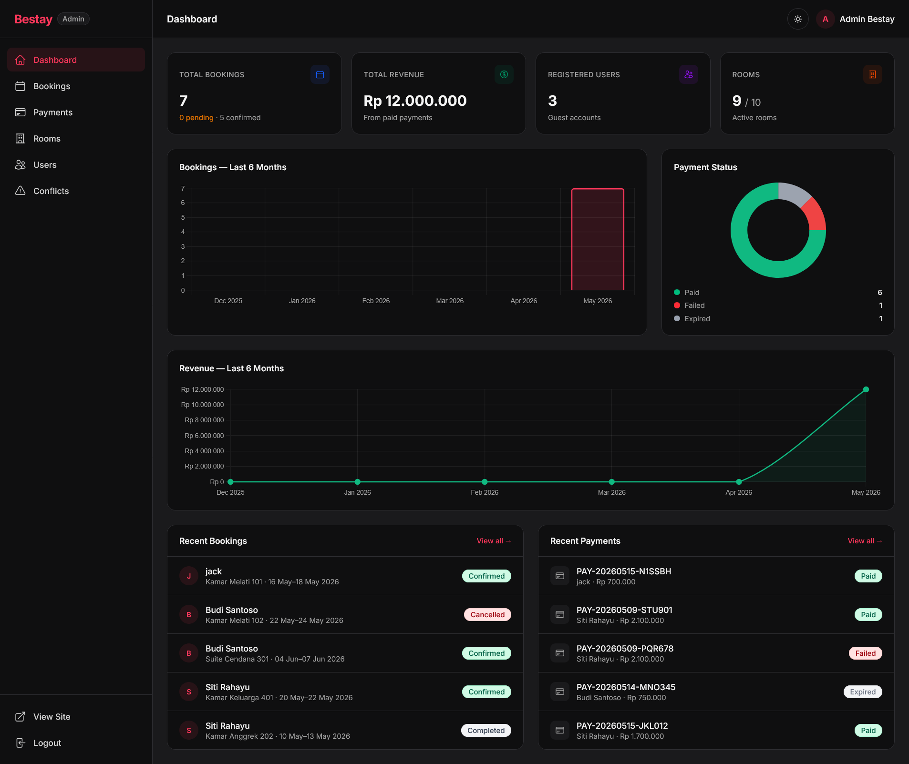

# 🏨 Bestay — Hotel Booking System

[](https://laravel.com)
[](https://php.net)
[](https://tailwindcss.com)
[](LICENSE)

Sistem reservasi hotel berbasis web yang dibangun dengan **Laravel 12**, **Tailwind CSS 4**, dan **Alpine.js**. Menyediakan fitur lengkap mulai dari pencarian kamar, booking, pembayaran, hingga panel admin dengan dashboard, monitoring payment, dan manajemen user.

> **📚 Tugas Mata Kuliah:** Pemrograman Web Lanjut (PWL)

---

## 📸 Screenshots

<details>
<summary><strong>Lihat Screenshots</strong></summary>

| Halaman Utama                           | Daftar Kamar                         | Detail Kamar                                     |
| :---------------------------------------:| :------------------------------------:| :------------------------------------------------:|
|  |  |  |

| Dashboard User                               | Pembayaran                               | Admin Dashboard                                |
| :--------------------------------------------:| :----------------------------------------:| :----------------------------------------------:|
|  |  |  |

| Admin Bookings                                   | Admin Payments                                   | Admin Users                                |
| :------------------------------------------------:| :------------------------------------------------:| :------------------------------------------:|
|  |  |  |

</details>

📄 Dokumentasi screenshot lengkap per halaman → [docs/screenshots.md](docs/screenshots.md)

---

## ✨ Fitur Utama

### 👤 Untuk Tamu (Guest/User)
- 🔍 Pencarian & filter kamar (tipe, harga, kapasitas)
- 📅 Booking kamar dengan pengecekan ketersediaan otomatis
- 💳 Sistem pembayaran (Bank Transfer, E-Wallet, Credit Card)
- 📊 Dashboard riwayat booking & status pembayaran
- 🔔 Notifikasi (booking dikonfirmasi, pembayaran berhasil, dll)
- ❌ Pembatalan booking dengan refund otomatis

### 🛡️ Untuk Admin
- 📊 **Dashboard** — statistik real-time, chart booking & revenue 6 bulan, distribusi status payment
- 🏠 **Manajemen Kamar** — CRUD lengkap, soft-delete (tidak bisa hapus jika ada booking aktif)
- 📋 **Manajemen Booking** — konfirmasi, tolak, selesaikan, dengan payment history per booking
- ⚠️ **Deteksi Konflik** — deteksi otomatis booking yang overlap pada kamar & tanggal yang sama
- 💰 **Monitoring Payment** — filter, search, verifikasi, override status (paid/failed/refunded)
- 👥 **Manajemen User** — lihat semua user, riwayat booking per user

### ⚙️ Sistem
- 🔐 Autentikasi lengkap (login, register, logout)
- 🛡️ Role-based access control (admin & user)
- ⏰ Auto-expire pembayaran yang tidak diselesaikan (scheduler setiap 5 menit)
- 📝 Payment audit trail (immutable status log)
- 🌐 REST API lengkap dengan Laravel Sanctum
- 📱 Responsive design (mobile-friendly)
- 🌙 Dark mode support
- 🚀 Siap deploy ke Railway (Nixpacks)

---

## 🛠️ Tech Stack

| Layer | Teknologi |
|-------|-----------|
| **Backend** | PHP 8.2, Laravel 12 |
| **Frontend** | Blade Templates, Tailwind CSS 4, Alpine.js 3 |
| **Charts** | Chart.js 4 |
| **Database** | SQLite (development) / MySQL (production) |
| **Authentication** | Laravel Sanctum (API tokens) |
| **Build Tool** | Vite 7 |
| **Deployment** | Railway via Nixpacks |

---

## 📖 Dokumentasi

| Dokumen | Deskripsi |
|---------|-----------|
| [Screenshots](docs/screenshots.md) | Dokumentasi visual semua halaman — publik, user, dan admin |
| [ERD — Entity Relationship Diagram](docs/erd.md) | Skema database lengkap, diagram Mermaid, relasi antar tabel, status transisi |
| [System Flow](docs/flow.md) | Alur booking, pembayaran, notifikasi, admin dashboard, scheduler — dengan diagram Mermaid |

---

## 🚀 Quick Start

```bash
composer install && npm install
cp .env.example .env && php artisan key:generate
type nul > database/database.sqlite   # Windows
php artisan migrate && php artisan db:seed
npm run build
composer dev
```

Buka **http://localhost:8000**

---

## 👤 Akun Demo

| Role | Email | Password |
|------|-------|----------|
| **Admin** | `admin@bestay.com` | `password` |
| **User** | `user@bestay.com` | `password` |
| **User** | `siti@bestay.com` | `password` |

---

## 📋 Prasyarat & Instalasi Lengkap

### Prasyarat

| Software | Versi Minimum |
|----------|---------------|
| PHP | >= 8.2 |
| Composer | >= 2.x |
| Node.js | >= 18.x |
| NPM | >= 9.x |

**PHP Extensions:** `pdo_sqlite`, `mbstring`, `xml`, `curl`, `bcmath`, `fileinfo`, `tokenizer`, `ctype`, `openssl`

### 1. Clone Repository

```bash
git clone https://github.com/reefai/bestay.git
cd bestay
```

### 2. Install Dependencies

```bash
composer install
npm install
```

### 3. Konfigurasi Environment

```bash
cp .env.example .env
php artisan key:generate
```

### 4. Setup Database

```bash
# Buat file database SQLite (Windows)
type nul > database/database.sqlite

# Linux/Mac
touch database/database.sqlite

php artisan migrate
php artisan db:seed
```

### 5. Build Frontend

```bash
npm run build
```

### 6. Jalankan Aplikasi

**Semua service sekaligus:**
```bash
composer dev
```

Menjalankan: Laravel server · Queue worker · Log viewer (Pail) · Vite HMR

**Manual:**
```bash
php artisan serve      # Terminal 1
npm run dev            # Terminal 2
php artisan queue:listen  # Terminal 3 (opsional)
```

---

## 📁 Struktur Project

```
bestay/
├── app/
│   ├── Console/Commands/        # ExpirePendingPayments
│   ├── Http/
│   │   ├── Controllers/         # API controllers (Sanctum)
│   │   │   └── Web/             # Web controllers (session)
│   │   │       ├── AdminDashboardController.php
│   │   │       ├── AdminBookingController.php
│   │   │       ├── AdminPaymentController.php
│   │   │       ├── AdminRoomController.php
│   │   │       └── AdminUserController.php
│   │   ├── Middleware/          # AdminMiddleware
│   │   └── Requests/            # Form Request validation
│   ├── Models/                  # User, Room, Booking, Payment, PaymentStatusLog, Notification
│   ├── Policies/                # BookingPolicy, PaymentPolicy, RoomPolicy
│   └── Services/
│       ├── BookingService.php
│       ├── PaymentService.php
│       ├── NotificationService.php
│       └── Payments/Exceptions/ # Custom exceptions
├── database/
│   ├── factories/
│   ├── migrations/
│   └── seeders/
├── resources/
│   ├── css/                     # Tailwind CSS + design tokens
│   ├── js/                      # Alpine.js
│   └── views/
│       ├── admin/               # Dashboard, bookings, payments, rooms, users
│       ├── auth/
│       ├── components/          # navbar, footer, status-badge, pagination
│       ├── dashboard/           # User dashboard
│       ├── layouts/             # app.blade.php, admin.blade.php
│       ├── payments/
│       └── rooms/
├── routes/
│   ├── api.php                  # REST API (Sanctum)
│   ├── web.php                  # Web routes (session)
│   └── console.php              # Scheduler
├── tests/
├── docs/                        # ERD, flow diagram
├── nixpacks.toml
└── CONTRIBUTING.md
```

---

## 🔌 API Documentation

Autentikasi menggunakan **Laravel Sanctum** (Bearer Token).

### Authentication

| Method | Endpoint | Deskripsi |
|--------|----------|-----------|
| `POST` | `/api/register` | Registrasi user baru |
| `POST` | `/api/login` | Login & dapatkan token |
| `POST` | `/api/logout` | Logout (revoke token) |
| `GET` | `/api/profile` | Lihat profil user |

**Contoh Login:**
```bash
curl -X POST http://localhost:8000/api/login \
  -H "Content-Type: application/json" \
  -d '{"email": "user@bestay.com", "password": "password"}'
```

**Response:**
```json
{
  "token": "1|abc123...",
  "user": { "id": 2, "name": "Budi Santoso", "email": "user@bestay.com" }
}
```

### Rooms

| Method | Endpoint | Auth | Deskripsi |
|--------|----------|------|-----------|
| `GET` | `/api/rooms` | ❌ | Daftar kamar aktif |
| `GET` | `/api/rooms/{id}` | ❌ | Detail kamar |
| `GET` | `/api/rooms/{id}/availability` | ✅ | Cek ketersediaan |
| `POST` | `/api/rooms` | ✅ Admin | Tambah kamar |
| `PUT` | `/api/rooms/{id}` | ✅ Admin | Update kamar |
| `DELETE` | `/api/rooms/{id}` | ✅ Admin | Hapus kamar |

### Bookings

| Method | Endpoint | Auth | Deskripsi |
|--------|----------|------|-----------|
| `GET` | `/api/bookings` | ✅ | Daftar booking saya |
| `POST` | `/api/bookings` | ✅ | Buat booking baru |
| `GET` | `/api/bookings/{id}` | ✅ | Detail booking |
| `PATCH` | `/api/bookings/{id}/cancel` | ✅ | Batalkan booking |

### Payments

| Method | Endpoint | Auth | Deskripsi |
|--------|----------|------|-----------|
| `GET` | `/api/payments` | ✅ | Daftar pembayaran saya |
| `GET` | `/api/payments/{id}` | ✅ | Detail pembayaran |
| `POST` | `/api/payments/{id}/method` | ✅ | Pilih metode bayar |
| `POST` | `/api/payments/{id}/process` | ✅ | Proses pembayaran |
| `POST` | `/api/payments/{id}/retry` | ✅ | Retry pembayaran gagal |

### Notifications

| Method | Endpoint | Auth | Deskripsi |
|--------|----------|------|-----------|
| `GET` | `/api/notifications` | ✅ | Daftar notifikasi |
| `PATCH` | `/api/notifications/{id}/read` | ✅ | Tandai dibaca |
| `POST` | `/api/notifications/read-all` | ✅ | Tandai semua dibaca |

### Admin Endpoints

| Method | Endpoint | Auth | Deskripsi |
|--------|----------|------|-----------|
| `GET` | `/api/admin/bookings` | ✅ Admin | Semua booking |
| `GET` | `/api/admin/bookings/conflicts` | ✅ Admin | Booking konflik |
| `PATCH` | `/api/admin/bookings/{id}/status` | ✅ Admin | Update status booking |
| `GET` | `/api/admin/payments` | ✅ Admin | Semua pembayaran |
| `PATCH` | `/api/admin/payments/{id}/status` | ✅ Admin | Override status payment |

> Semua endpoint yang membutuhkan auth: `Authorization: Bearer {token}`

---

## 🗄️ Database Schema

```
┌──────────┐       ┌──────────────┐       ┌──────────┐
│  users   │       │   bookings   │       │  rooms   │
├──────────┤       ├──────────────┤       ├──────────┤
│ id (PK)  │◄──────│ user_id (FK) │       │ id (PK)  │
│ name     │       │ room_id (FK) │──────►│ name     │
│ email    │       │ check_in     │       │ type     │
│ password │       │ check_out    │       │ price    │
│ role     │       │ total_price  │       │ capacity │
└──────────┘       │ status       │       │ is_active│
     ▲             │ notes        │       └──────────┘
     │             └──────┬───────┘
     │                    │
     │             ┌──────▼───────┐       ┌──────────────────────┐
     │             │   payments   │       │ payment_status_logs  │
     │             ├──────────────┤       ├──────────────────────┤
     │             │ id (PK)      │◄──────│ payment_id (FK)      │
     │             │ booking_id   │       │ from_status          │
     │             │ reference    │       │ to_status            │
     │             │ amount       │       │ actor_user_id (FK)   │
     │             │ method       │       │ actor_type           │
     │             │ status       │       │ reason               │
     │             │ paid_at      │       └──────────────────────┘
     │             │ expires_at   │
     └─────────────│ verified_by  │
                   └──────────────┘

     ┌────────────────┐
     │ notifications  │
     ├────────────────┤
     │ user_id (FK)   │──► users.id
     │ booking_id (FK)│──► bookings.id
     │ type / title   │
     │ message        │
     │ is_read        │
     └────────────────┘
```

**Payment status transitions:**
```
pending → paid | failed | expired
paid    → refunded  (hanya jika booking cancelled)
```

**Booking status transitions:**
```
pending   → confirmed | cancelled
confirmed → cancelled | completed
```

Lihat [docs/erd.md](docs/erd.md) untuk dokumentasi lengkap dengan diagram Mermaid.

---

## 🚢 Deployment

### Railway (Recommended)

Aplikasi sudah dikonfigurasi untuk deploy ke [Railway](https://railway.app) via Nixpacks (`nixpacks.toml`).

#### 1. Buat Project

- Push repo ke GitHub
- Railway: **New Project** → **Deploy from GitHub repo**
- Railway otomatis mendeteksi Nixpacks

#### 2. Setup Database

**Opsi A — SQLite:**
- Tambah **Volume** di Railway, mount ke `/app/storage` dan `/app/database`
- Set `DB_CONNECTION=sqlite`

**Opsi B — MySQL:**
- **Add Plugin** → **MySQL**
- Set `DB_CONNECTION=mysql`

#### 3. Environment Variables

| Variable | Value |
|----------|-------|
| `APP_KEY` | Jalankan `php artisan key:generate --show` lokal |
| `APP_ENV` | `production` |
| `APP_DEBUG` | `false` |
| `APP_URL` | URL Railway kamu |

#### 4. Scheduler

Railway tidak punya cron bawaan. Gunakan [cron-job.org](https://cron-job.org) (gratis) untuk trigger `payments:expire` setiap 5 menit, atau deploy instance kedua dengan start command `php artisan schedule:work`.

#### 5. Queue Worker

- **Sederhana:** Set `QUEUE_CONNECTION=sync`
- **Production:** Tambah service baru, start command: `php artisan queue:work --tries=3`

---

## 🧪 Testing

```bash
# Semua test
php artisan test

# Via composer
composer test

# Dengan coverage
php artisan test --coverage

# Test spesifik
php artisan test --filter=TestName
```

---

## 🤝 Kontribusi

Lihat [CONTRIBUTING.md](CONTRIBUTING.md) untuk panduan lengkap.

1. Fork repository
2. Buat branch: `git checkout -b feature/nama-fitur`
3. Commit: `git commit -m 'feat: deskripsi singkat'`
4. Push: `git push origin feature/nama-fitur`
5. Buat Pull Request

---

## 📄 Lisensi

[MIT License](LICENSE)

---

<p align="center">
  <sub>Built with ❤️ using Laravel 12 · Tailwind CSS 4 · Alpine.js · Chart.js</sub>
</p>
