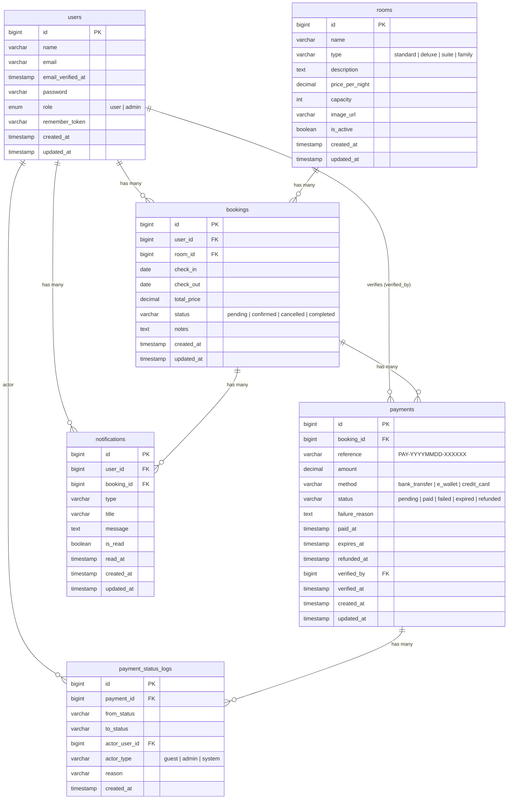

# ERD — Entity Relationship Diagram

## Diagram (Mermaid)



---

## ASCII Overview

```
┌──────────┐       ┌──────────────┐       ┌──────────┐
│  users   │       │   bookings   │       │  rooms   │
├──────────┤       ├──────────────┤       ├──────────┤
│ id (PK)  │◄──────│ user_id (FK) │       │ id (PK)  │
│ name     │       │ room_id (FK) │──────►│ name     │
│ email    │       │ check_in     │       │ type     │
│ password │       │ check_out    │       │ price    │
│ role     │       │ total_price  │       │ capacity │
└──────────┘       │ status       │       │ is_active│
     ▲             │ notes        │       └──────────┘
     │             └──────┬───────┘
     │                    │
     │             ┌──────▼───────┐       ┌──────────────────────┐
     │             │   payments   │       │ payment_status_logs  │
     │             ├──────────────┤       ├──────────────────────┤
     │             │ id (PK)      │◄──────│ payment_id (FK)      │
     │             │ booking_id   │       │ from_status          │
     │             │ reference    │       │ to_status            │
     │             │ amount       │       │ actor_user_id (FK)───┼──► users.id
     │             │ method       │       │ actor_type           │
     │             │ status       │       │ reason               │
     │             │ paid_at      │       │ created_at           │
     │             │ expires_at   │       └──────────────────────┘
     │             │ refunded_at  │
     └─────────────│ verified_by  │  (admin yang verifikasi)
                   │ verified_at  │
                   └──────────────┘

     ┌────────────────┐
     │ notifications  │
     ├────────────────┤
     │ id (PK)        │
     │ user_id (FK)   │──► users.id
     │ booking_id (FK)│──► bookings.id
     │ type           │
     │ title          │
     │ message        │
     │ is_read        │
     │ read_at        │
     └────────────────┘
```

---

## Status Transitions

### Booking Status

```
                ┌─────────┐
                │ PENDING │
                └────┬────┘
                     │
          ┌──────────┴──────────┐
          ▼                     ▼
    ┌───────────┐         ┌───────────┐
    │ CONFIRMED │         │ CANCELLED │ ◄── (terminal)
    └─────┬─────┘         └───────────┘
          │
    ┌─────┴──────┐
    ▼            ▼
┌──────────┐  ┌───────────┐
│ COMPLETED│  │ CANCELLED │ ◄── (terminal)
│(terminal)│  └───────────┘
└──────────┘
```

### Payment Status

```
              ┌─────────┐
              │ PENDING │ ← expires in 60 min
              └────┬────┘
                   │
       ┌───────────┼───────────┐
       ▼           ▼           ▼
   ┌──────┐   ┌────────┐  ┌─────────┐
   │ PAID │   │ FAILED │  │ EXPIRED │
   └──┬───┘   └────────┘  └─────────┘
      │       (terminal)  (terminal)
      ▼
 ┌──────────┐
 │ REFUNDED │ ← hanya jika booking cancelled
 └──────────┘
 (terminal)
```

---

## Tables

### `users`

| Column | Type | Constraints | Notes |
|--------|------|-------------|-------|
| id | BIGINT UNSIGNED | PK, AUTO_INCREMENT | |
| name | VARCHAR(255) | NOT NULL | |
| email | VARCHAR(255) | NOT NULL, UNIQUE | |
| email_verified_at | TIMESTAMP | NULLABLE | |
| password | VARCHAR(255) | NOT NULL | Hashed via bcrypt |
| role | ENUM | NOT NULL, DEFAULT `user` | `user` \| `admin` |
| remember_token | VARCHAR(100) | NULLABLE | Laravel auth |
| created_at | TIMESTAMP | NULLABLE | |
| updated_at | TIMESTAMP | NULLABLE | |

**Relationships:**
- Has many `bookings`
- Has many `notifications`
- Has many `payments` as verifier (`verified_by`)
- Has many `payment_status_logs` as actor (`actor_user_id`)

---

### `rooms`

| Column | Type | Constraints | Notes |
|--------|------|-------------|-------|
| id | BIGINT UNSIGNED | PK, AUTO_INCREMENT | |
| name | VARCHAR(255) | NOT NULL | |
| type | VARCHAR(255) | NOT NULL | `standard` \| `deluxe` \| `suite` \| `family` |
| description | TEXT | NULLABLE | |
| price_per_night | DECIMAL(10,2) | NOT NULL | Dalam IDR |
| capacity | INTEGER | NOT NULL | Maks tamu |
| image_url | VARCHAR(255) | NULLABLE | |
| is_active | BOOLEAN | NOT NULL, DEFAULT TRUE | Soft-delete flag |
| created_at | TIMESTAMP | NULLABLE | |
| updated_at | TIMESTAMP | NULLABLE | |

**Index:** `(type, is_active, price_per_night, capacity)`

**Relationships:**
- Has many `bookings`

---

### `bookings`

| Column | Type | Constraints | Notes |
|--------|------|-------------|-------|
| id | BIGINT UNSIGNED | PK, AUTO_INCREMENT | |
| user_id | BIGINT UNSIGNED | FK → users.id, CASCADE DELETE | |
| room_id | BIGINT UNSIGNED | FK → rooms.id, CASCADE DELETE | |
| check_in | DATE | NOT NULL | |
| check_out | DATE | NOT NULL | |
| total_price | DECIMAL(10,2) | NOT NULL | nights × price_per_night |
| status | VARCHAR(255) | NOT NULL, DEFAULT `pending` | Lihat transisi di atas |
| notes | TEXT | NULLABLE | |
| created_at | TIMESTAMP | NULLABLE | |
| updated_at | TIMESTAMP | NULLABLE | |

**Index:** `(room_id, check_in, check_out, status)`

**Relationships:**
- Belongs to `user`
- Belongs to `room`
- Has many `payments`
- Has one `activePayment` → payments WHERE status IN (`pending`,`paid`), latest
- Has many `notifications`

---

### `payments`

| Column | Type | Constraints | Notes |
|--------|------|-------------|-------|
| id | BIGINT UNSIGNED | PK, AUTO_INCREMENT | |
| booking_id | BIGINT UNSIGNED | FK → bookings.id, CASCADE DELETE | |
| reference | VARCHAR(64) | NOT NULL, UNIQUE | Format: `PAY-YYYYMMDD-XXXXXX` |
| amount | DECIMAL(10,2) | NOT NULL | = booking.total_price |
| method | VARCHAR(32) | NULLABLE | `bank_transfer` \| `e_wallet` \| `credit_card` |
| status | VARCHAR(16) | NOT NULL, DEFAULT `pending` | Lihat transisi di atas |
| failure_reason | TEXT | NULLABLE | Wajib saat status = `failed` |
| paid_at | TIMESTAMP | NULLABLE | Di-set saat status → `paid` |
| expires_at | TIMESTAMP | NOT NULL | = created_at + 60 menit |
| refunded_at | TIMESTAMP | NULLABLE | Di-set saat status → `refunded` |
| verified_by | BIGINT UNSIGNED | FK → users.id, NULLABLE, NULL ON DELETE | Admin yang verifikasi |
| verified_at | TIMESTAMP | NULLABLE | |
| created_at | TIMESTAMP | NULLABLE | |
| updated_at | TIMESTAMP | NULLABLE | |

**Indexes:**
- `(booking_id, status)` — pencarian active payment
- `(status)` — query expiry
- `(expires_at)` — query expiry
- Partial unique (SQLite/Postgres): `payments_one_active_per_booking` WHERE status IN (`pending`,`paid`)

**Relationships:**
- Belongs to `booking`
- Has many `statusLogs`
- Belongs to `verifier` (user)

---

### `payment_status_logs`

| Column | Type | Constraints | Notes |
|--------|------|-------------|-------|
| id | BIGINT UNSIGNED | PK, AUTO_INCREMENT | |
| payment_id | BIGINT UNSIGNED | FK → payments.id, CASCADE DELETE | |
| from_status | VARCHAR(16) | NULLABLE | NULL saat pertama kali dibuat |
| to_status | VARCHAR(16) | NOT NULL | |
| actor_user_id | BIGINT UNSIGNED | FK → users.id, NULLABLE, NULL ON DELETE | |
| actor_type | VARCHAR(16) | NOT NULL | `guest` \| `admin` \| `system` |
| reason | VARCHAR(500) | NULLABLE | |
| created_at | TIMESTAMP | NOT NULL, DEFAULT CURRENT_TIMESTAMP | |

**Index:** `(payment_id, created_at)`

**Catatan:**
- Immutable audit log — tidak ada kolom `updated_at` (`UPDATED_AT = null` di model)
- Setiap perubahan status payment menyisipkan satu baris baru
- `from_status = NULL` pada pembuatan awal (`pending`)

**Relationships:**
- Belongs to `payment`
- Belongs to `actor` (user)

---

### `notifications`

| Column | Type | Constraints | Notes |
|--------|------|-------------|-------|
| id | BIGINT UNSIGNED | PK, AUTO_INCREMENT | |
| user_id | BIGINT UNSIGNED | FK → users.id, CASCADE DELETE | |
| booking_id | BIGINT UNSIGNED | FK → bookings.id, CASCADE DELETE | |
| type | VARCHAR(255) | NOT NULL | Lihat tabel tipe di bawah |
| title | VARCHAR(255) | NOT NULL | Dalam Bahasa Indonesia |
| message | TEXT | NOT NULL | Dalam Bahasa Indonesia |
| is_read | BOOLEAN | NOT NULL, DEFAULT FALSE | |
| read_at | TIMESTAMP | NULLABLE | |
| created_at | TIMESTAMP | NULLABLE | |
| updated_at | TIMESTAMP | NULLABLE | |

**Tipe notifikasi:**

| Type | Trigger |
|------|---------|
| `booking_confirmed` | Booking dikonfirmasi (via payment success atau admin) |
| `booking_cancelled` | User membatalkan booking |
| `status_updated` | Admin mengubah status booking |
| `payment_succeeded` | Pembayaran berhasil |
| `payment_failed` | Pembayaran gagal |
| `payment_expired` | Pembayaran kedaluwarsa |
| `payment_refunded` | Pembayaran direfund |

**Relationships:**
- Belongs to `user`
- Belongs to `booking`
