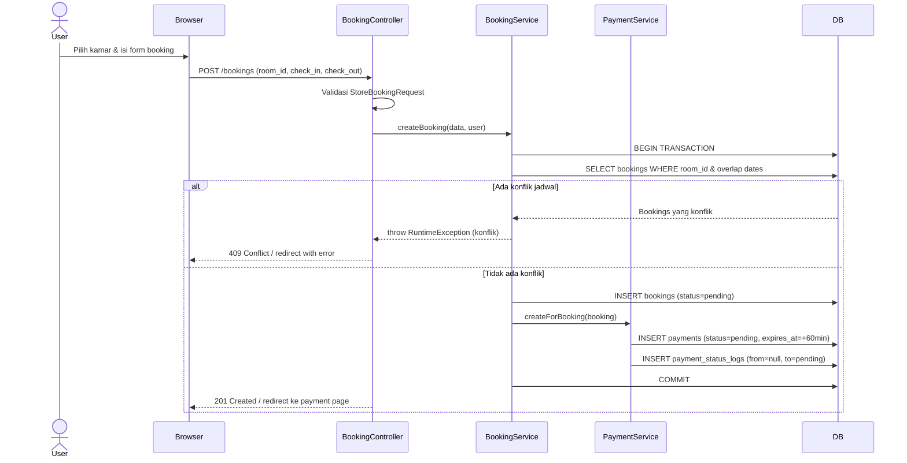
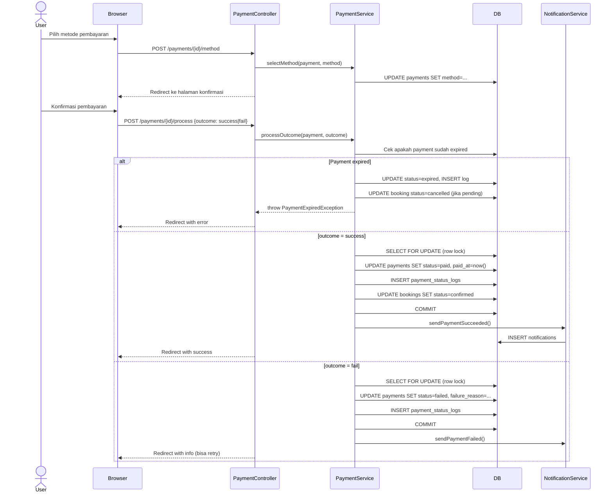
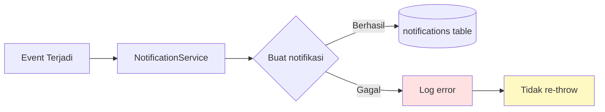
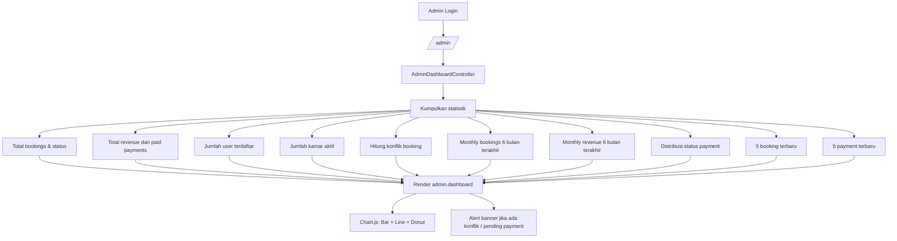
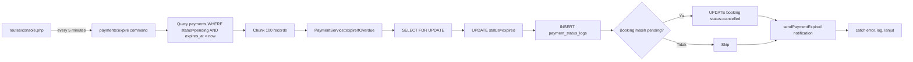
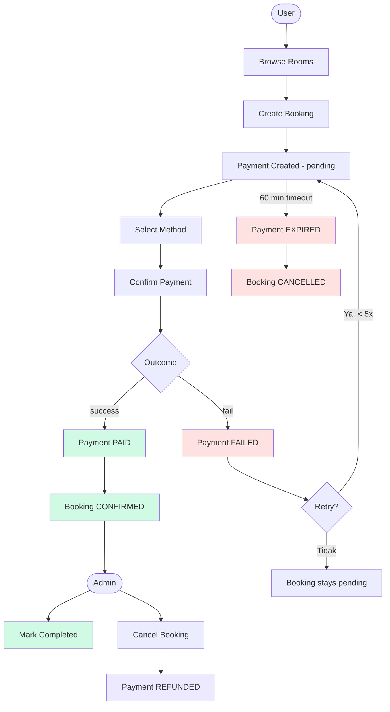

# System Flow

## Daftar Isi

1. [Booking Flow](#1-booking-flow)
2. [Payment Flow](#2-payment-flow)
3. [Notification Flow](#3-notification-flow)
4. [Admin Flow](#4-admin-flow)
5. [Scheduler Flow](#5-scheduler-flow)

---

## 1. Booking Flow



### Langkah-langkah

1. **User browse kamar** — publik, tidak perlu login
2. **User submit booking** (room_id, check_in, check_out, notes) — harus login
3. **Validasi** via `StoreBookingRequest`:
   - `room_id` ada di tabel rooms
   - `check_in >= hari ini`
   - `check_out > check_in`
   - `notes` maks 500 karakter (opsional)
4. **Service layer** `BookingService::createBooking()`:
   - Cek kamar aktif (`is_active = true`)
   - Cek tidak ada booking yang overlap (`getConflictingBookings()`)
   - Hitung `total_price = nights × room.price_per_night`
   - Buat booking status `pending`
   - Buat payment via `PaymentService::createForBooking()` (status `pending`, expiry 60 menit)
   - Semua dalam satu database transaction
5. **Response** — 201 Created atau 409 Conflict / 422 Unprocessable

---

## 2. Payment Flow



### Status & Transisi

```
              ┌─────────┐
              │ PENDING │ ← expires in 60 min
              └────┬────┘
                   │
       ┌───────────┼───────────┐
       ▼           ▼           ▼
   ┌──────┐   ┌────────┐  ┌─────────┐
   │ PAID │   │ FAILED │  │ EXPIRED │
   └──┬───┘   └────────┘  └─────────┘
      │       (terminal)  (terminal)
      ▼
 ┌──────────┐
 │ REFUNDED │ ← hanya jika booking cancelled
 └──────────┘
 (terminal)
```

### Metode Pembayaran

| Metode | Key | Keterangan |
|--------|-----|------------|
| Bank Transfer | `bank_transfer` | Verifikasi manual oleh admin |
| E-Wallet | `e_wallet` | Simulasi otomatis |
| Credit Card | `credit_card` | Simulasi otomatis |

### Mekanisme Expiry

- Pending payment memiliki window expiry 60 menit (`PaymentService::EXPIRY_MINUTES`)
- Command `ExpirePendingPayments` berjalan setiap 5 menit via scheduler (`routes/console.php`)
- Command query semua payment `pending` dengan `expires_at < now()`, proses per chunk 100
- **Lazy expiry** juga terjadi saat user membuka halaman payment (`PaymentController::show()` memanggil `expireIfOverdue()`)
- Saat payment expired, booking terkait dibatalkan (jika masih `pending`)

### Mekanisme Retry

- Maks **5 percobaan pembayaran** per booking (`PaymentService::MAX_ATTEMPTS`)
- Hanya payment `failed` yang bisa di-retry
- Booking terkait harus masih berstatus `pending`
- Retry membuat **payment baru** (dengan expiry 60 menit baru)
- Pengecekan active payment menggunakan row-level lock (`SELECT ... FOR UPDATE`) untuk mencegah race condition

### Concurrency Safety

- Semua transisi status berjalan dalam `DB::transaction()`
- Row-level lock (`lockForUpdate()`) pada record payment memastikan akses serial
- `createForBooking()` juga mengunci payment yang ada untuk mencegah duplikasi active payment
- Partial unique index pada `payments(booking_id) WHERE status IN ('pending','paid')` (SQLite/Postgres)

---

## 3. Notification Flow



> **Aturan penting:** Kegagalan notifikasi selalu di-catch dan di-log, **tidak pernah di-throw ulang**. Ini memastikan kegagalan notifikasi tidak membatalkan transaksi payment atau booking.

### Tipe Notifikasi

| Type | Trigger | Judul |
|------|---------|-------|
| `booking_confirmed` | Booking dikonfirmasi (via payment success atau admin) | Booking Dikonfirmasi |
| `booking_cancelled` | User membatalkan booking | Booking Dibatalkan |
| `status_updated` | Admin mengubah status booking | Status Booking Diperbarui |
| `payment_succeeded` | Pembayaran berhasil | Pembayaran Berhasil |
| `payment_failed` | Pembayaran gagal | Pembayaran Gagal |
| `payment_expired` | Pembayaran kedaluwarsa | Pembayaran Kedaluwarsa |
| `payment_refunded` | Pembayaran direfund | Pembayaran Direfund |

---

## 4. Admin Flow

### 4.1 Admin Dashboard



### 4.2 Booking Management

```mermaid
flowchart LR
    A[/admin/bookings] --> B{Filter status?}
    B -->|Ya| C[Query dengan WHERE status=...]
    B -->|Tidak| D[Query semua booking]
    C & D --> E[Paginate 15/halaman]
    E --> F[Tampilkan tabel]

    F --> G[Klik View]
    G --> H[/admin/bookings/id]
    H --> I[Detail booking + payment history]
    I --> J{Status saat ini?}
    J -->|pending| K[Tombol: Confirm / Cancel]
    J -->|confirmed| L[Tombol: Complete / Cancel]
    J -->|terminal| M[Tidak ada aksi]

    K & L --> N[PATCH /admin/bookings/id/status]
    N --> O[BookingService::updateStatus]
    O --> P{Transisi valid?}
    P -->|Ya| Q[UPDATE bookings]
    P -->|Tidak| R[Error: invalid transition]
```

### 4.3 Payment Monitoring & Verifikasi

```mermaid
flowchart LR
    A[/admin/payments] --> B{Filter?}
    B --> C[status / method / search]
    C --> D[Paginate 20/halaman]
    D --> E[Tampilkan tabel]

    E --> F[Klik View]
    F --> G[/admin/payments/id]
    G --> H[Detail payment + status history timeline]
    H --> I{Status saat ini?}
    I -->|pending| J[Override: paid / failed]
    I -->|paid + booking cancelled| K[Override: refunded]
    I -->|terminal| L[Tidak ada aksi]

    J & K --> M[PATCH /admin/payments/id/status]
    M --> N[PaymentService::adminOverride]
    N --> O[Validasi precondition]
    O --> P[SELECT FOR UPDATE]
    P --> Q[UPDATE payments + INSERT log]
    Q --> R[Kirim notifikasi]
```

### 4.4 User Management

```mermaid
flowchart LR
    A[/admin/users] --> B{Filter?}
    B --> C[search / role]
    C --> D[Paginate 20/halaman]
    D --> E[Tabel user + jumlah booking]

    E --> F[Klik View]
    F --> G[/admin/users/id]
    G --> H[Profil user + riwayat booking lengkap]
```

### 4.5 Conflict Detection

```mermaid
flowchart TD
    A[/admin/bookings/conflicts] --> B[Query semua booking pending/confirmed]
    B --> C[Group by room_id]
    C --> D{Tiap room: ada >= 2 booking?}
    D -->|Tidak| E[Skip]
    D -->|Ya| F[Cek overlap O n²]
    F --> G{A.check_in < B.check_out AND A.check_out > B.check_in?}
    G -->|Ya| H[Tandai sebagai konflik]
    G -->|Tidak| I[Tidak konflik]
    H --> J[Kumpulkan ID unik]
    J --> K[Filter dari collection yang sudah di-load]
    K --> L[Group by room_id]
    L --> M[Tampilkan per room]
```

### Access Control

| Layer | Mekanisme |
|-------|-----------|
| Web routes | `middleware(['auth', 'admin'])` + prefix `/admin` |
| API routes | `middleware('auth:sanctum')` + `middleware('admin')` + prefix `/api/admin` |
| `AdminMiddleware` | Cek `$user->role === 'admin'`, return 403 JSON (API) atau abort 403 (web) |
| Policies | Enforce admin-only untuk room create/update/delete |

---

## 5. Scheduler Flow



Didefinisikan di `routes/console.php`:

```php
Schedule::command('payments:expire')
    ->everyFiveMinutes()
    ->withoutOverlapping();
```

> `withoutOverlapping()` memastikan command tidak berjalan bersamaan jika eksekusi sebelumnya belum selesai.

---

## Ringkasan Alur Lengkap


