# Screenshots — Bestay

Dokumentasi visual semua halaman aplikasi Bestay, mencakup tampilan user dan panel admin.

## Daftar Isi

1. [Halaman Publik](#1-halaman-publik)
2. [Autentikasi](#2-autentikasi)
3. [Dashboard User](#3-dashboard-user)
4. [Pembayaran](#4-pembayaran)
5. [Panel Admin](#5-panel-admin)

---

## 1. Halaman Publik

### Home Page

Halaman utama dengan hero section full-viewport, kamar unggulan, kategori tipe kamar, fitur unggulan, dan CTA.

---

### Daftar Kamar

Halaman browse kamar dengan filter tipe, harga, dan kapasitas. Menampilkan grid card kamar yang tersedia.

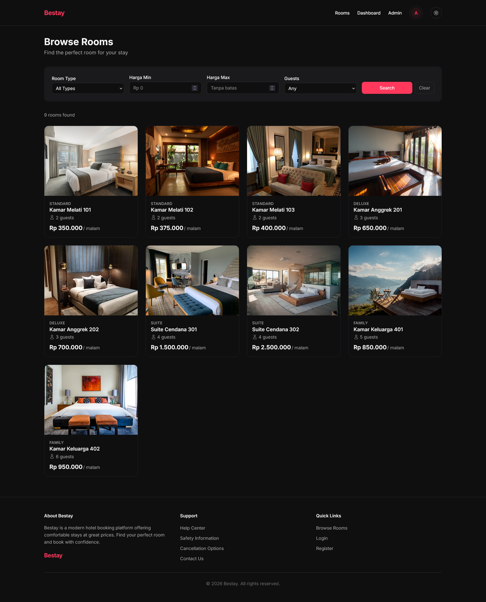

---

### Detail Kamar

Halaman detail kamar dengan foto, deskripsi, fasilitas, highlight, kebijakan, rating, dan form booking.

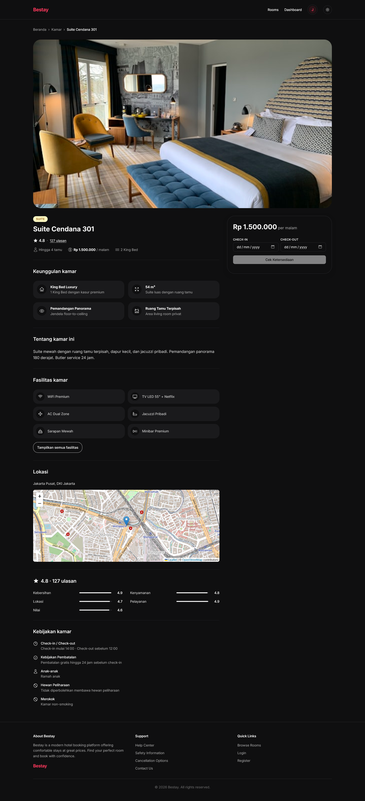

---

## 2. Autentikasi

### Login

Form login dengan email dan password.

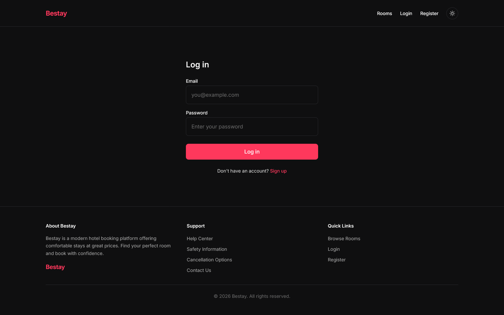

---

### Register

Form registrasi akun baru.

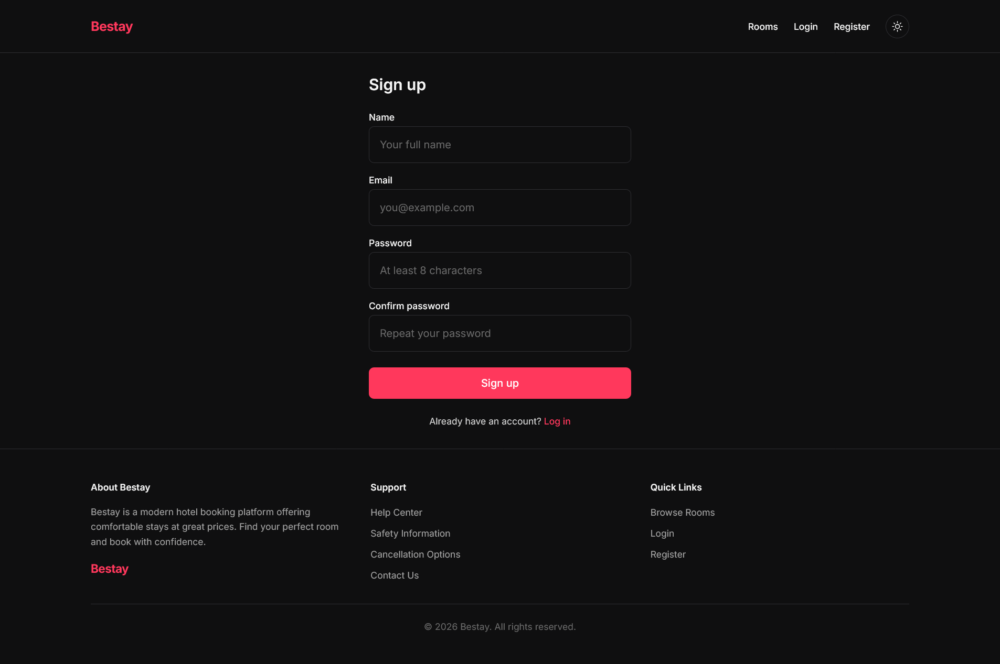

---

## 3. Dashboard User

### Daftar Booking

Dashboard user menampilkan semua riwayat booking beserta status dan tombol aksi (Pay Now, Cancel).

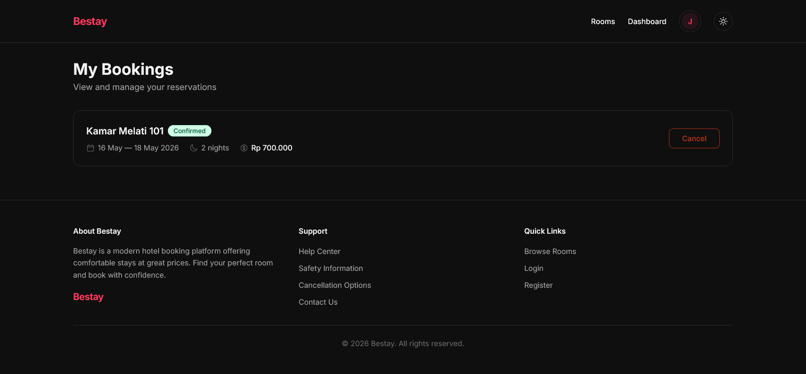

---

### Detail Booking

Halaman detail booking menampilkan informasi kamar, tanggal menginap, total harga, dan riwayat pembayaran.

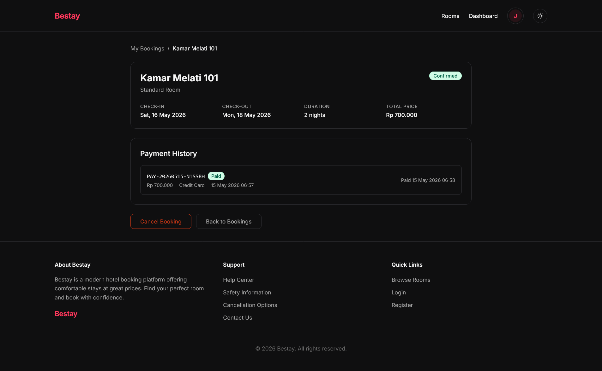

---

## 4. Pembayaran

### Halaman Pembayaran

Halaman pembayaran menampilkan detail tagihan, pilihan metode pembayaran, dan status expiry countdown.

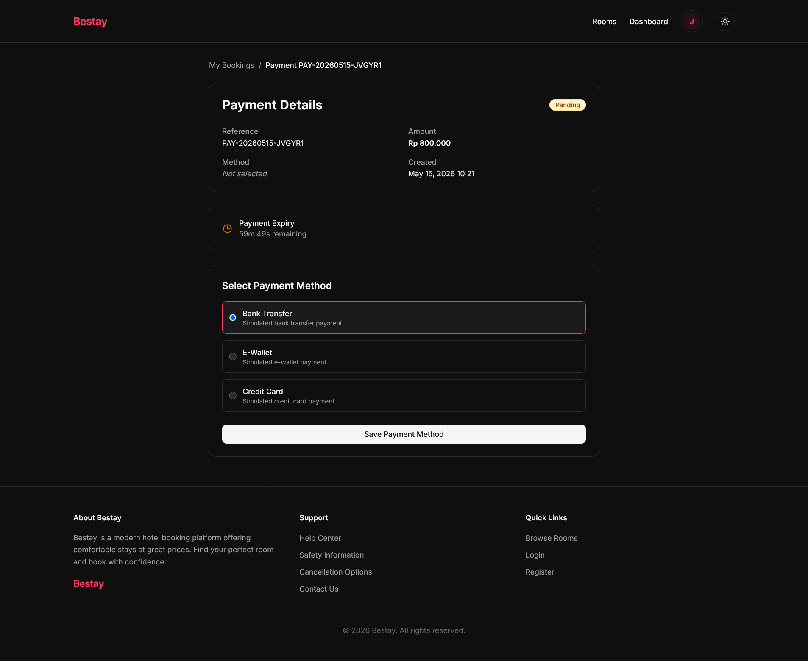

---

### Konfirmasi Pembayaran

Form konfirmasi pembayaran dengan pilihan outcome (success/fail) dan input alasan kegagalan.

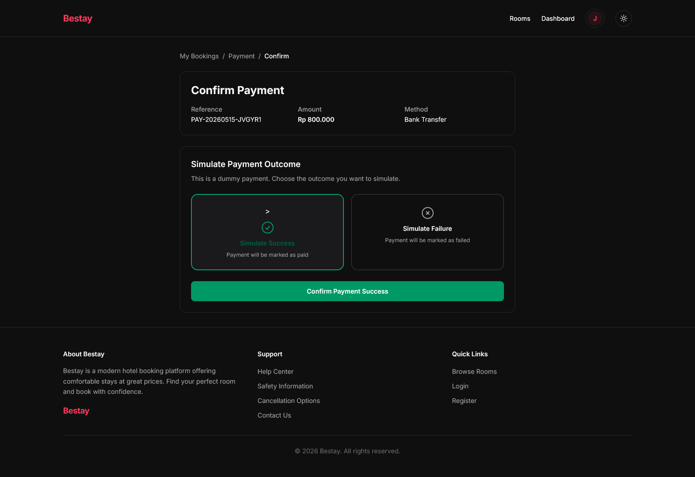

---

## 5. Panel Admin

### Admin Dashboard

Dashboard admin dengan statistik real-time, chart booking & revenue 6 bulan, donut chart status payment, alert konflik, dan tabel aktivitas terbaru.

---

### Manajemen Booking

Tabel semua booking dengan filter status, pagination, dan link ke detail masing-masing booking.

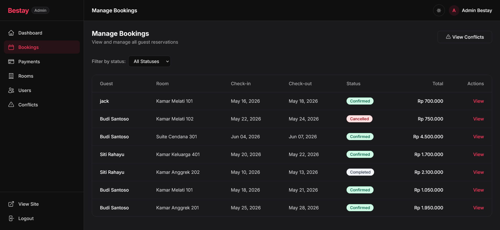

---

### Detail Booking (Admin)

Halaman detail booking dari sisi admin — informasi tamu, kamar, tanggal, riwayat payment, dan tombol aksi update status (Confirm / Complete / Cancel).

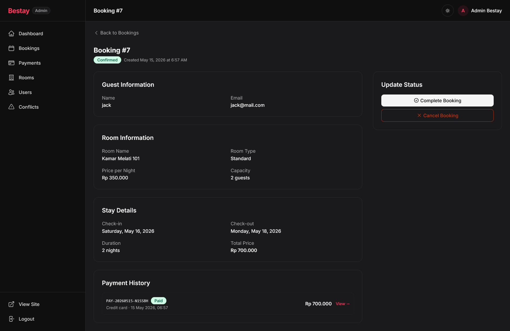

---

### Deteksi Konflik Booking

Halaman khusus yang menampilkan booking-booking yang memiliki tanggal overlap pada kamar yang sama, dikelompokkan per kamar.

---

### Monitoring Payment

Tabel semua payment dengan filter status, metode, dan pencarian. Menampilkan referensi, tamu, kamar, metode, status, dan jumlah.

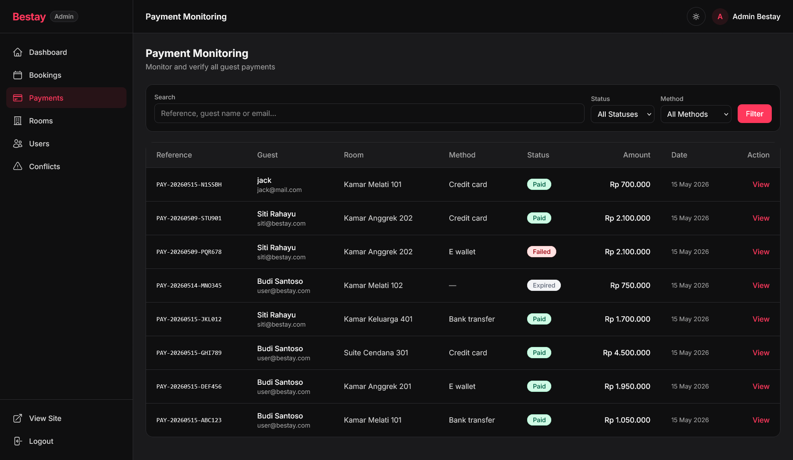

---

### Detail Payment (Admin)

Halaman detail payment dengan informasi lengkap, timeline riwayat status, dan form admin override (paid / failed / refunded).

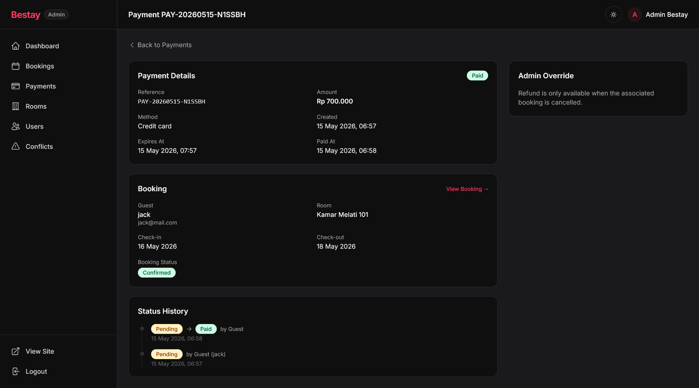

---

### Manajemen Kamar

Tabel semua kamar (aktif & nonaktif) dengan tombol edit dan deactivate.

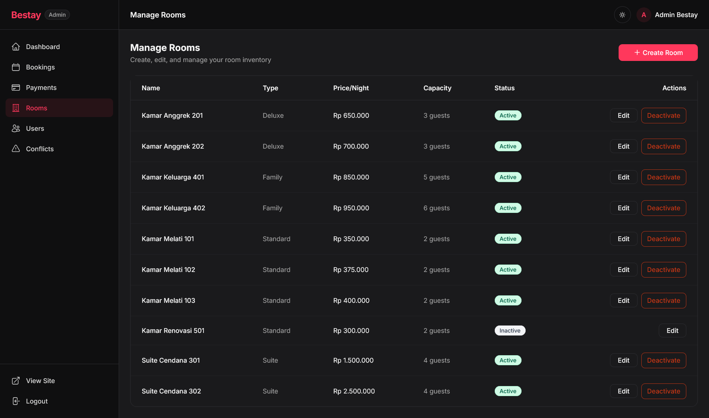

---

### Tambah / Edit Kamar

Form untuk membuat atau mengedit kamar — nama, tipe, deskripsi, harga, kapasitas, dan URL gambar.

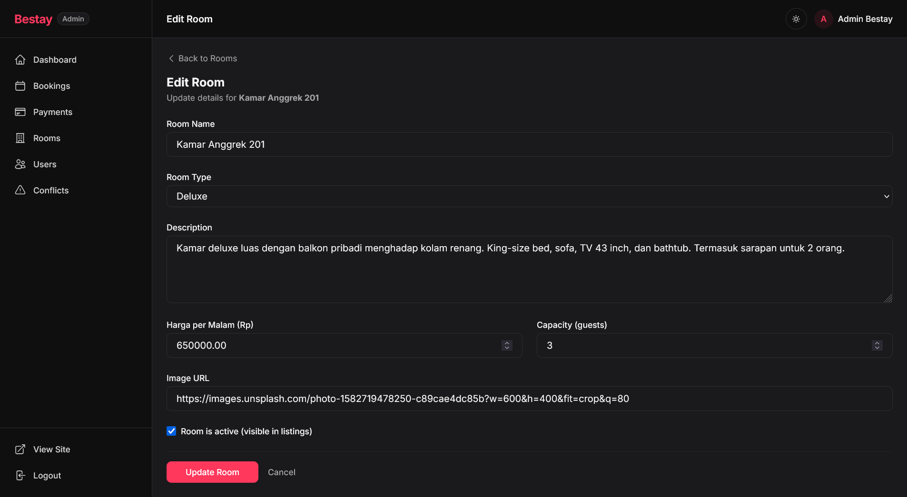

---

### Manajemen User

Tabel semua user terdaftar dengan filter role dan pencarian, menampilkan jumlah booking per user.

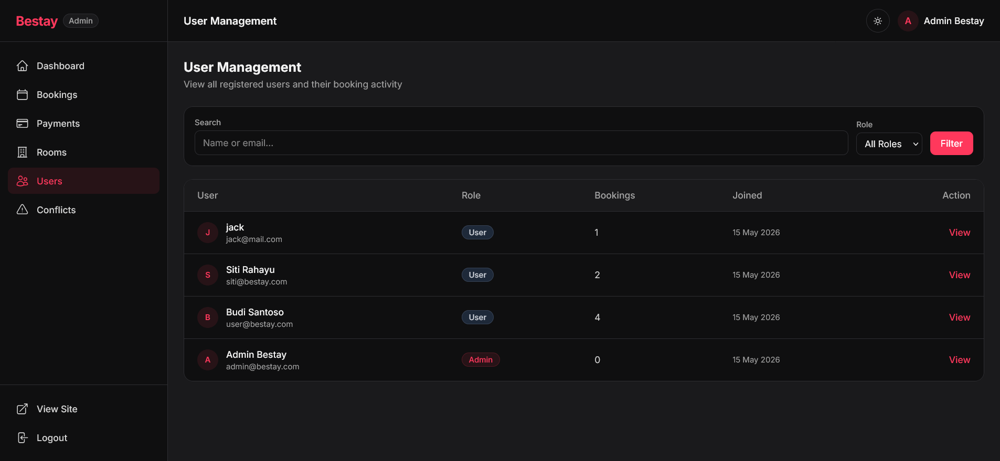

---

### Detail User (Admin)

Profil user lengkap dengan statistik booking dan riwayat semua booking yang pernah dibuat.

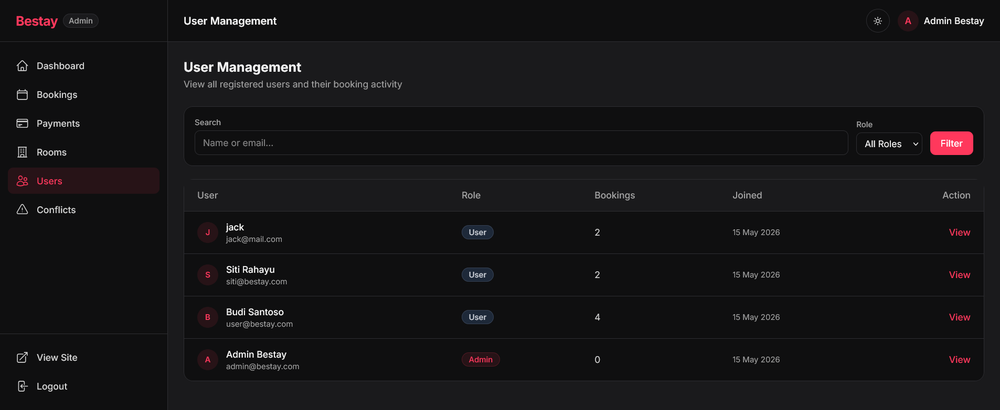

---

> 📁 Semua file gambar disimpan di folder `docs/screenshots/`.
> Tambahkan screenshot dengan nama file sesuai referensi di atas setelah menjalankan aplikasi.
